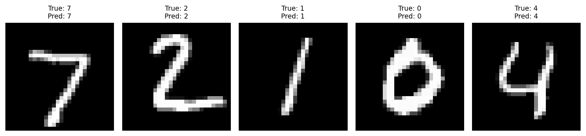
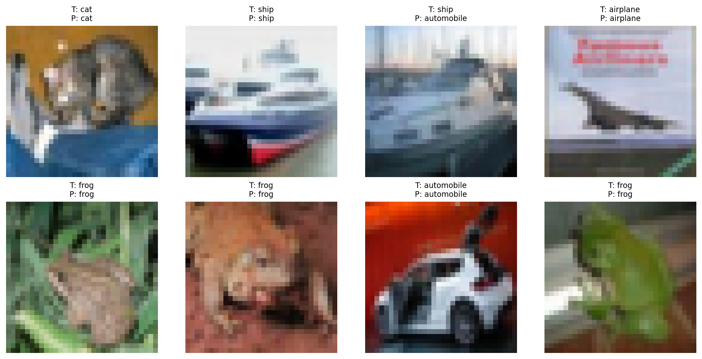

# 实验结果总览

这份文档把仓库里四条主线放在一起看，方便快速比较“做了什么”和“为什么值得展示”。

## 图像分类主线

### MNIST

| 模型 | 最佳测试准确率 | 关键意义 |
| --- | ---: | --- |
| `MLP baseline` | `96.12%` | 建立最小可运行分类基线 |
| `CNN improved` | `99.47%` | 展示卷积结构在图像任务上的明显优势 |



### CIFAR-10

| 版本 | 最佳测试准确率 | 关键意义 |
| --- | ---: | --- |
| `baseline` | `73.25%` | 作为简单 CNN 对照组 |
| `improved` | `87.35%` | 展示训练策略和结构优化的明显收益 |
| `resnet` | `95.33%` | 说明结构升级对复杂图像任务的重要性 |



这两条图像分类线合起来表达的是：

- 仓库不是只放“最终最强版本”，而是保留了从基线到改进的过程。
- 读者不仅能看结果，也能看出每一步提升来自哪里。

## 语言模型主线

### Character Transformer

| 版本 | 参数量 | 最佳验证损失 | 最佳验证困惑度 | 关键意义 |
| --- | ---: | ---: | ---: | --- |
| `bigram` | 4,225 | `2.5441` | `12.73` | 最小字符级 next-token baseline |
| `transformer` | 826,433 | `2.1182` | `8.32` | 补齐最小 Transformer 骨架 |
| `transformer v2` | 2,286,593 | `1.6733` | `5.33` | 扩大上下文和模型容量 |
| `transformer v3` | 2,286,593 | `1.5333` | `4.63` | 当前仓库里更成熟的字符级生成结果 |


`transformer v3` 在 `temperature = 0.75` 下的样例摘录：

```text
ROMEO:
See, she hath princely, proper, I have desperous
The lives man of Rome, our voices them ne'er brook
Not be the fight to the blood of this breads:
My good daughter them against with soft a noble offence,
As I am, the should seem down, as which may me?
```

### Subword GPT

| 版本 | 词表大小 | 参数量 | 最佳验证损失 | 最佳验证困惑度 | 关键意义 |
| --- | ---: | ---: | ---: | ---: | --- |
| `subword-gpt v1` | 512 | 6,490,624 | `2.9711` | `19.51` | 补齐 tokenizer、special tokens、padding mask 和采样控制 |
| `subword-gpt v2` | 512 | 9,194,976 | `2.5797` | `13.19` | 在保留完整子词级 GPT 工作流的前提下，把验证表现继续向前推进 |
| `smoke-subword-gpt` | 300 | 121,344 | `5.6604` | `287.27` | 用于链路冒烟验证 |


`subword-gpt v2` 在 `temperature = 0.8` 下的样例摘录：

```text
ROMEO:
Peace, for no good time: for you are bear not
false the pleasure from my tongue.
```

## 语言模型对比该怎么理解

`char-transformer v3` 和 `subword-gpt v2` 的 token 粒度不同，因此它们的困惑度不适合直接当作绝对优劣结论。

更适合公开展示的对比方式，是把“粒度、规模、生成观感、工程形态”放在一起看：

| 模型 | token 粒度 | 参数量 | 最佳验证困惑度 | 生成观感 | 更适合展示的重点 |
| --- | --- | ---: | ---: | --- | --- |
| `char-transformer v3` | 字符级 | 2,286,593 | `4.63` | 当前仓库里更成熟、更像对白的生成结果 | 最小 Transformer 与自注意力主线已经真正跑通 |
| `subword-gpt v2` | 子词级 BPE | 9,194,976 | `13.19` | 仍有明显语义不稳，但局部短句已开始成形 | tokenizer、special tokens、padding mask、采样控制更接近真实 GPT 工作流 |

更准确的理解方式是：

- `char-transformer v3` 更适合展示最小语言模型和自注意力主线已经真正跑通。
- `subword-gpt v2` 更适合展示工程流程已经从教学版模型推进到更接近真实 GPT 的形态，而且比 `v1` 更接近可用实验结果。

## 查看下一层内容

- 看项目实现与运行方式：进入各项目 `README.md`
- 看完整原理与推导：进入 [笔记索引](../notes/README.md)
- 看整个仓库的阅读顺序：进入 [学习路线与项目导航](./学习路线与项目导航.md)
