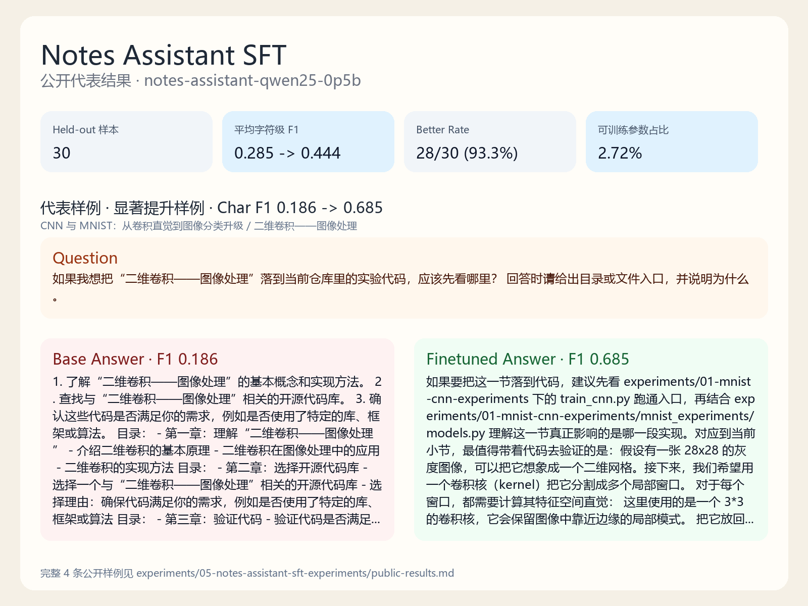

# Notes Assistant SFT 实验速查

这个目录承接基于预训练模型的轻量微调主线，使用现有中文笔记构建领域问答数据，并在小型指令模型上完成 `SFT + LoRA/QLoRA + 评测 + Demo` 的完整流程。

## 关联笔记

- [07-指令微调与LoRA：从预训练模型到领域助教](../../notes/07-指令微调与LoRA：从预训练模型到领域助教.md)

## 实验内容

| 实验 | 作用 | 代表结果 |
| --- | --- | --- |
| `notes-assistant-qwen25-0p5b` | 标准训练配置 | 字符级 F1 `0.285 -> 0.444`，`28/30` 样本优于基座模型 |
| `notes-assistant-template-structure` | 结构型模板消融 | 字符级 F1 `0.285 -> 0.382`，`21/30` 样本优于基座模型 |
| `notes-assistant-template-content` | 内容型模板消融 | 字符级 F1 `0.285 -> 0.301`，`16/30` 样本优于基座模型 |
| `notes-assistant-template-core-only` | 单模板消融 | 字符级 F1 `0.285 -> 0.305`，`17/30` 样本优于基座模型 |
| `notes-assistant-qwen25-0p5b-smoke` | 链路冒烟验证 | 字符级 F1 `0.331 -> 0.331`，仅用于验证链路可运行 |

## 代表结果

正式评测结果为平均字符级 F1 `0.285 -> 0.444`，`30` 道 held-out 测试题里有 `28` 道微调后回答优于基座模型。结果解读和代表问答样例见第 `07` 章笔记。

<p align="center">
  
</p>

## 模板组消融

在固定基座模型、LoRA 配置和同一套 `30` 道 held-out 测试题的前提下，只改变训练/验证集中保留的问题模板，可以更直接地看到训练问题分布如何改变模型能力边界。

| 模板组 | 保留的训练模板 | 训练 / 验证 / 测试样本 | 平均字符级 F1 | tuned better rate | 结果解读 |
| --- | --- | --- | ---: | ---: | --- |
| `full` | `explain_core + key_points + study_focus + chapter_position + experiment_bridge` | `240 / 30 / 30` | `0.444` | `93.33%` | 当前整体最稳的配置 |
| `structure` | `explain_core + chapter_position + experiment_bridge` | `144 / 18 / 30` | `0.382` | `70.00%` | 结构型题提升明显，尤其是代码入口与章节位置判断 |
| `content` | `explain_core + key_points + study_focus` | `144 / 18 / 30` | `0.301` | `53.33%` | 更容易保留概念解释与复习辅助，但桥接代码入口的能力下降 |
| `core_only` | `explain_core` | `48 / 6 / 30` | `0.305` | `56.67%` | 单模板也能学到部分内容表达，但能力分布明显变窄 |

完整模板混合给出当前最稳的整体结果；结构型模板更强于章节定位与代码桥接；内容型与单模板配置的能力覆盖更窄。

## 输出目录

- `data/notes-assistant-qa.jsonl`：自动生成的指令数据
- `data/notes-assistant-dataset-summary.json`：数据集统计和章节切分摘要
- `outputs/<experiment-name>/adapter/`：LoRA adapter 权重与 tokenizer
- `outputs/<experiment-name>/metrics.json`：训练和验证指标
- `outputs/<experiment-name>/samples.md`：测试样例生成结果
- `outputs/<experiment-name>/evaluation/`：评测报告、预测明细、按 `template_id` 分组指标和人工打分模板
- `outputs/template-group-ablation-summary.md`：多组模板消融的汇总 Markdown 报告

## 代码入口

| 路径 | 作用 |
| --- | --- |
| `prepare_dataset.py` | 从现有笔记自动生成 JSONL 指令数据 |
| `train_sft.py` | SFT 训练入口 |
| `evaluate_qa.py` | 基座模型与 adapter 对比评测入口 |
| `launch_demo.py` | Gradio Demo 入口 |
| `summarize_template_ablation.py` | 多组模板消融结果汇总入口 |
| `notes_assistant_experiments/dataset_builder.py` | 章节解析、切分和样本生成 |
| `notes_assistant_experiments/train.py` | LoRA/QLoRA 训练主流程 |
| `notes_assistant_experiments/evaluation.py` | 自动评测与人工评审表导出 |
| `notes_assistant_experiments/ablation.py` | 模板组消融汇总逻辑 |

## 当前边界

- v1 只做 `SFT + LoRA/QLoRA`，不做 `RAG`、多轮记忆和工具调用。
- 数据只来自当前仓库的课程笔记，因此更适合作为领域学习助教，而不是通用聊天模型。
- 模板组消融这一轮只改变训练问题类型，不改变基座模型、LoRA 配置和测试集。
- 这条实验线的重点是补齐真实 LLM 工程工作流，并进一步练习小规模研究设计，而不是追求最强效果。

## 运行命令

基础流程：

```bash
pip install -r ../requirements.txt
python prepare_dataset.py --overwrite
python train_sft.py --experiment-name notes-assistant-qwen25-0p5b
python evaluate_qa.py --run-dir outputs/notes-assistant-qwen25-0p5b
python launch_demo.py --run-dir outputs/notes-assistant-qwen25-0p5b
```

小规模冒烟：

```bash
python train_sft.py --smoke
```

常用覆盖参数：

```bash
python train_sft.py ^
  --experiment-name notes-assistant-dev ^
  --max-seq-length 512 ^
  --batch-size 1 ^
  --grad-accum-steps 16 ^
  --learning-rate 2e-4 ^
  --epochs 3 ^
  --lora-r 16 ^
  --lora-alpha 32
```

未准备 `bitsandbytes` / `4-bit` 量化环境时，可先切到普通 LoRA 验证链路：

```bash
python train_sft.py --quantization-mode none --smoke
```

模板组消融：

```bash
python train_sft.py --experiment-name notes-assistant-template-content --template-group content
python train_sft.py --experiment-name notes-assistant-template-structure --template-group structure
python train_sft.py --experiment-name notes-assistant-template-core-only --template-group core_only
python evaluate_qa.py --run-dir outputs/notes-assistant-template-content
python evaluate_qa.py --run-dir outputs/notes-assistant-template-structure
python evaluate_qa.py --run-dir outputs/notes-assistant-template-core-only
python summarize_template_ablation.py ^
  --run-dir outputs/notes-assistant-qwen25-0p5b ^
  --run-dir outputs/notes-assistant-template-content ^
  --run-dir outputs/notes-assistant-template-structure ^
  --run-dir outputs/notes-assistant-template-core-only ^
  --output outputs/template-group-ablation-summary.md
```
