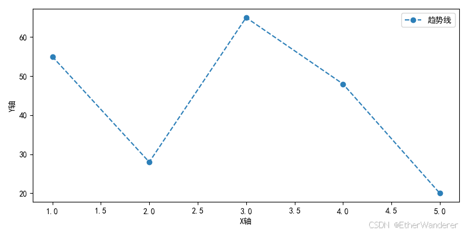
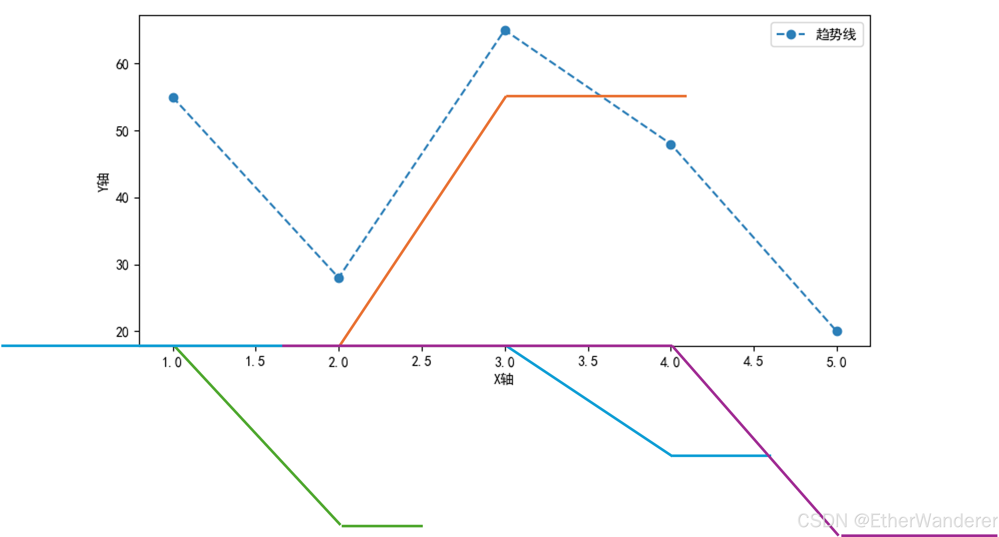
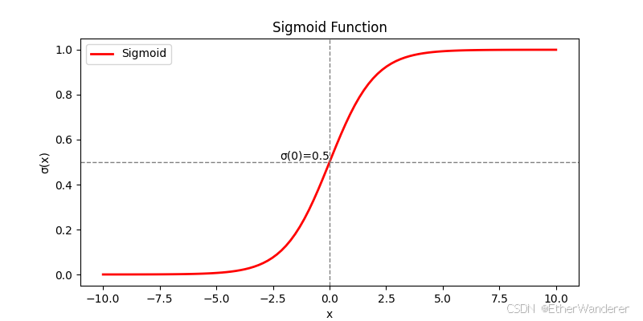
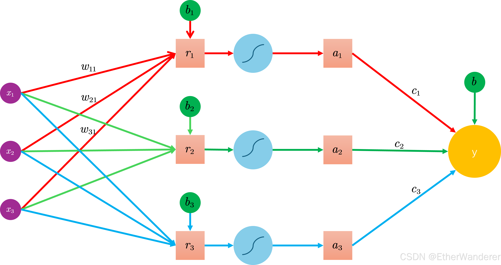
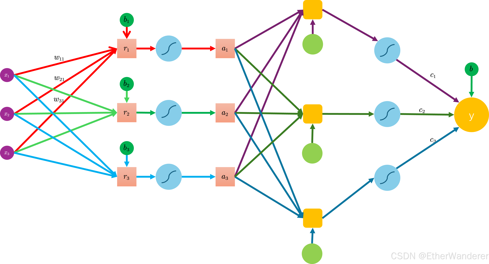
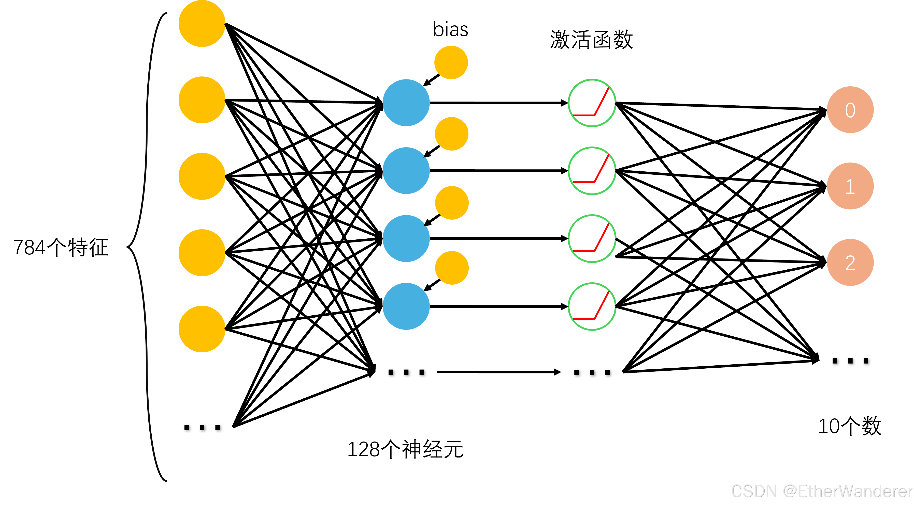
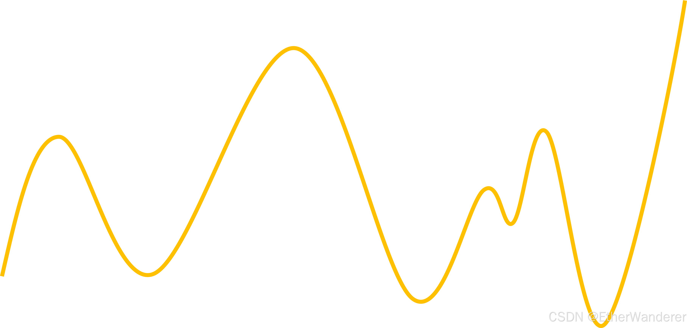
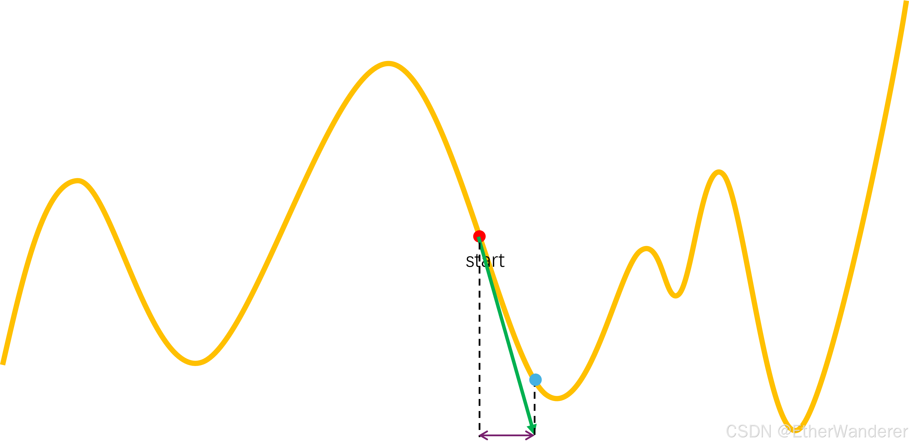
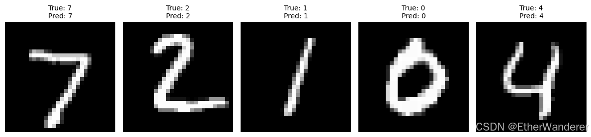

# MLP 与 MNIST：从数据预处理到训练流程

> 说明：这篇笔记整理自我的个人博客原文，原始发布地址为：<https://blog.csdn.net/galaxy223/article/details/146328910?fromshare=blogdetail&sharetype=blogdetail&sharerId=146328910&sharerefer=PC&sharesource=galaxy223&sharefrom=from_link>

这篇笔记围绕一个典型的入门任务展开：使用多层感知机（MLP）完成 MNIST 手写数字识别。重点不在于追求复杂模型，而在于梳理一个最基础的图像分类 pipeline 是如何搭起来的，包括数据预处理、模型结构、损失函数、优化器和训练循环。

在阅读时，可以重点关注三件事：

- 输入数据如何从图像转换为模型可处理的张量
- 全连接网络如何把 28x28 的像素映射到 10 个类别
- 训练过程中损失如何驱动参数更新

## 用一个熟悉的类比理解机器学习流程

初学机器学习时，`梯度下降`、`过拟合`、`泛化` 这些术语往往比较抽象。为了建立直觉，可以先把整个训练过程类比成一次长期备考。这个类比并不严格对应数学定义，但有助于先建立整体框架。

### 1. 资料整理：数据预处理

训练开始之前，数据需要先被整理成统一格式。对于图像任务，这通常包括张量化、标准化，以及按照模型输入要求调整形状。可以把这个过程理解成整理复习资料：如果材料本身混乱，后续训练就很难稳定进行。

### 2. 复习规划：模型架构

模型结构决定了信息如何被处理。在线性模型无法表达复杂模式时，就需要使用带非线性激活的神经网络。对应到备考场景，可以理解为根据目标难度选择合适的复习策略，而不是用同一套方法解决所有问题。

### 3. 错题修正：梯度下降

神经网络训练的核心是“预测 - 计算误差 - 更新参数”的循环。第一次预测往往并不准确，而损失函数提供了误差度量，梯度则给出参数调整方向。这个过程很像整理错题本后不断修正思路。

### 4. 模考检验：拟合诊断

模型不仅要在训练集上表现好，还要在未见过的数据上保持效果。训练误差和验证误差之间的关系，可以帮助判断模型是欠拟合、过拟合，还是处于较健康的状态。

### 5. 最终考核：泛化能力

测试集的作用是评估模型在真正未参与训练的数据上的表现。一个有效的模型，不只是“记住训练样本”，而是能够把学到的模式迁移到新样本上。

## PyTorch 核心组件

这份实现依赖 PyTorch 及其数据处理工具。先看导入部分：

### 导入基础库


```python
import torch
from torchvision import transforms, datasets
import torch.nn as nn
import torch.optim as optim
```

这些库的作用分别是：

- `torch`：PyTorch 核心库，负责张量计算和自动微分
- `transforms`：定义图像预处理流程
- `datasets`：提供常见数据集接口
- `torch.nn`：定义网络结构
- `optim`：提供优化器

## 数据预处理与特征工程

MNIST 中的每个样本本质上都是一张 `28x28` 的灰度图。对模型而言，图像不是“图片文件”，而是一组像素值。预处理的目标就是把这些像素组织成适合网络输入的张量形式。

对于这里的 MLP，输入不是二维图像，而是一维向量，因此除了标准化之外，还需要把图像展平成长度为 `784` 的向量。


```python
# 数据预处理
transform = transforms.Compose([
    transforms.ToTensor(),
    transforms.Normalize((0.1307,), (0.3081,)),
    transforms.Lambda(lambda x: x.view(-1))
])

# 加载数据集
train_dataset = datasets.MNIST(
    root='./data', train=True, download=True, transform=transform
)
test_dataset = datasets.MNIST(
    root='./data', train=False, download=True, transform=transform
)
```

这里可以注意两点：

- `transform` 虽然定义在前面，但真正执行是在样本被读取时
- `train_dataset` 和 `test_dataset` 分别对应训练集和测试集，MNIST 默认包含 6 万张训练图像和 1 万张测试图像

参数说明：

- `root`：数据集下载或读取的位置
- `train`：是否使用训练集
- `download`：本地没有数据时自动下载
- `transform`：对每个样本依次执行的预处理流程

这条 `transform` 流水线包含三步：

1. `ToTensor`
将图像转换为 PyTorch 张量，并把像素值缩放到 `[0, 1]`。

2. `Normalize`
使用 MNIST 的全局均值 `0.1307` 和标准差 `0.3081` 做标准化，减少不同样本之间的数值尺度差异。

3. `Lambda(lambda x: x.view(-1))`
把 `28x28` 图像展平成 `784` 维向量，以适配全连接网络输入。

## 从分段线性到神经网络的直观理解

### 用 Hard Sigmoid 引入非线性

如果数据整体上不是单一线性关系，而是由多个局部近似线性的区段组成，那么单一线性模型通常不足以拟合这种变化。一个自然的想法是：先用多个局部线性函数描述不同区段，再把它们组合起来。

假设存在如图所示的序列数据（实际数据点远多于图中示意点，整体呈现多段近似线性的分布特征）：
> 


面对这种数据，一个直接做法是把不同区段视为独立线性模型：

$$
y=b_i+w_i\cdot x
$$
其中下标 $i$ 表示第 $i$ 个区段。对应的定义域划分可表示为：
$$
y=
\begin{cases}
b_1+w_1x, & x_1 < x < x_2 \\
b_2+w_2x, & x_2 < x < x_3 \\
\vdots & \vdots
\end{cases}
$$
但如果直接优化每段的斜率 $w_i$、截距 $b_i$ 和分界点 $x_i$，参数组织会变得很繁琐，训练也不方便。

一种更容易参数化的方式，是把每个区段写成“在某个位置开始激活，并在区间外保持常值”的形式：
$$
y_i(x)=
\begin{cases}
0, & x < x_i \\
b_i+w_i(x-x_i), & x_i \leq x \leq x_{i+1} \\
b_i+w_i(x_{i+1}-x_i), & x > x_{i+1}
\end{cases}
$$
这里的 $b_i$ 已经不再是原始线性回归里的同一个截距概念，而是重参数化之后的一部分。

可视化效果如图所示：
> 


此时，整体函数可以看成多个局部基函数的线性叠加。为了继续简化表达，可以进一步把输出范围统一到标准形式。

通过引入缩放因子 $c_i$，可将分段函数改写为：
$$
y=c_i\cdot
\begin{cases}
0, & x < x_i \\
b_i+\frac{1}{x_{i+1}-x_i}x, & x_i < x < x_{i+1} \\
1, & x > x_{i+1}
\end{cases}
$$
此时重点参数可以收缩为 $b_i$、$c_i$ 和区间位置。再进一步，定义：
$$w_i\equiv\frac1{x_{i+1}-x_i}$$
也就是把区间宽度转成可学习的权重参数。于是可以写成统一形式：
$$
y=c_i\cdot
\begin{cases}
0, & x < x_i \\
b_i+w_ix, & x_i < x < x_{i+1} \\
1, & x > x_{i+1}
\end{cases}
$$
这里的 $b_i$ 和 $w_i$ 也都已经是重参数化后的量。这样的分段函数可视为 Hard Sigmoid 的一种直观原型。整体预测模型可以表示为：
$$
y=\mathrm{const}+\sum_i \mathrm{HardSigmoid}_i(x)
$$
它的意义在于说明：只要把多个带阈值的非线性单元叠加起来，就可以表示更复杂的函数形状。这也为后续引入连续可导的激活函数做了铺垫。

### 用 Sigmoid 构造可导的非线性单元

Hard Sigmoid 的直觉比较清晰，但分段形式并不够平滑。更常见的替代是连续可导的 Sigmoid 函数：
$$
\sigma(x) = \frac{1}{1+e^{-x}}
$$
它的 S 形曲线与“阈值逐渐开启”的行为比较接近：
> 


要让 Sigmoid 真正具备表达能力，通常需要三类可调参数：

1. 值域缩放：通过前置系数 $c_i$ 控制输出幅度
2. 水平平移：通过偏置 $b_i$ 控制位置
3. 斜率调节：通过权重 $w_i$ 控制曲线陡峭程度

于是单个非线性单元可以写成：
$$
y = c_i \cdot \sigma(w_ix + b_i) 
$$
其中：
- $w_i$ 调节曲线上升速率
- $b_i$ 控制曲线水平位置
- $c_i$ 缩放输出范围

多个这样的单元叠加后，整体模型可写成：
$$
y = b + \sum_i c_i \cdot \sigma(b_i + w_ix)
$$
当输入扩展为多维特征 $x_1, x_2, \dots, x_n$ 时，每个神经元可以写成：
$$
\sigma(b_i + \sum_j w_{ij}x_j)
$$
这就自然导出了标准神经网络的一般形式：
$$
y = b + \sum_i c_i \cdot \sigma\left( b_i + \sum_j w_{ij}x_j \right)
$$
这个推导的重点不在于严格证明，而在于建立直觉：神经网络可以理解为多个可调非线性基函数的组合，每个神经元都在特征空间里做一次线性变换和非线性映射。

下面结合结构图看一次前向计算过程：
> 


计算流程可以分成三步：

1. 线性变换：输入特征向量 $x=[x_1,x_2,x_3]^T$ 与权重矩阵 $W$ 做线性组合
   $$
   r = b + Wx \quad \text{其中} \quad W=\begin{bmatrix}
   w_{11} & w_{21} & w_{31}\\
   w_{12} & w_{22} & w_{32}\\
   w_{13} & w_{23} & w_{33}
   \end{bmatrix}
   $$
   这一步把输入从原始特征空间映射到隐层空间。

2. 非线性激活：对每个分量施加 Sigmoid
   $$
   a = \sigma(r) = [\sigma(r_1), \sigma(r_2), \sigma(r_3)]^T
   $$
   此时每个神经元输出都被压缩到 $(0,1)$ 区间。

3. 输出组合：对激活后的隐层表示再次做线性组合
   $$
   y = b_{out} + c^Ta
   $$
   其中 $c=[c_1,c_2,c_3]^T$ 为输出层权重向量。

如果移除中间的非线性激活，整个系统会退化成一个线性模型：
$$
y = b_{out} + c^T(b + Wx) = (b_{out}+c^Tb) + c^TWx
$$
这也是为什么激活函数是神经网络表达能力的关键来源。


### 神经元类比的直观意义

“神经网络”这个名字来自对生物神经元工作方式的类比。虽然现代深度学习模型与真实神经系统并不等价，但这个类比在入门阶段仍然有帮助。

在线性组合得到中间量 $r$ 之后，激活函数会对信号做一次筛选。可以把它理解为一种阈值机制：较弱的信号被压低，较强的信号被保留下来。下面这张图可以帮助理解这种过程：
> 


- 激活层的作用，是让一部分信息被压制、另一部分信息被继续传递。
- 当这种“线性变换 + 非线性激活”的结构被多次堆叠后，模型就能逐层提取更复杂的特征。
- 这也是“深度学习”中“深度”一词的直观来源。

## 模型架构设计与实现

回到 MNIST 任务本身。经过预处理后，每张图像已经被展平成长度为 `784` 的向量。接下来要做的是构建一个模型，把这 `784` 维输入映射到 `10` 个类别。

在分类任务中，标签通常可以看成 10 维类别空间中的一个索引。若写成 one-hot 向量，数字 `7` 的目标形式可以表示为：
$$
\left( \begin{matrix}
0 & 0 & 0 & 0 & 0 & 0 & 0 & 1 & 0 & 0
\end{matrix} \right) ^{\tau}
$$

这里使用一个最基础的两层全连接网络：

- 输入层：`784` 个节点，对应图像像素
- 隐层：`128` 个节点
- 输出层：`10` 个节点，对应 `0-9` 十个类别

具体结构如下图所示：
> 


### ReLU的数学优势

在真正实现模型时，这里不再使用 Sigmoid，而改用更常见的 ReLU（Rectified Linear Unit）：
$$
\text{ReLU}(x) = \max(0,x)
$$
它和 Sigmoid 一样都建立在线性变换之后，但计算更简单，在深层网络里也更常见：

| 特性        | Sigmoid                      | ReLU                    |
|-------------|------------------------------|-------------------------|
| 前驱计算    | 保留$w \cdot x + b$线性结构  | 同样保留线性计算基础     |
| 输出范围    | 压缩至[0,1]区间              | 非负无界输出            |
| 计算效率    | 需计算指数函数               | 只需阈值判断            |

ReLU 输出非负、计算开销低，也更有利于梯度传播，因此在实践中通常比 Sigmoid 更适合作为隐藏层激活函数。

下面用 PyTorch 实现这个多层感知机：


```python
class MLP(nn.Module):
    def __init__(self):
        super().__init__()
        self.fc1 = nn.Linear(28 * 28, 128)  # 输入到隐层的线性投影
        self.act = nn.ReLU()             # 非线性激活函数
        self.fc2 = nn.Linear(128, 10)    # 隐层到输出的映射

    def forward(self, x):
        x = self.fc1(x)  # 展开的784维向量→128维隐空间
        x = self.act(x)  # 引入非线性决策边界
        return self.fc2(x)  # 输出logits空间

model = MLP()
```

可以把这段代码理解为三步：

1. `fc1`：把 `784` 维输入映射到 `128` 维隐层
2. `ReLU`：引入非线性
3. `fc2`：把隐层特征映射到 `10` 维输出空间

需要注意的是，输出层直接返回的是 `logits`，而不是已经归一化的概率。后面在介绍损失函数时会解释为什么这样设计。


```python
# 设置设备
device = torch.device("cuda:0" if torch.cuda.is_available() else "cpu")
model = model.to(device)
```

这一步只是把模型放到计算设备上：如果能用 GPU 就用 GPU，否则回退到 CPU。

## 损失函数与优化算法
### 交叉熵损失函数

分类任务里最常用的损失函数之一就是交叉熵。对于 MNIST 这种单标签分类问题，它衡量的是模型预测分布和真实标签之间的差异。

如果真实标签是 one-hot 编码，那么交叉熵可以写成：
$$
H(P,Q) = -\log Q(c)
$$
其中 $c$ 表示真实类别，$Q(c)$ 表示模型给真实类别分配的预测概率。

它有两个直观特性：

- 当模型把真实类别概率预测得很高时，损失接近 `0`
- 当模型把真实类别概率预测得很低时，损失会迅速变大

这也是交叉熵特别适合分类任务的原因。

### 梯度下降（Gradient Descent）

训练的目标，是不断调整模型参数，使损失函数尽可能小。最常见的方法是梯度下降。

在工程实践里，通常会看到三种常见形式：

1. 随机梯度下降（SGD）：每次用一个样本更新参数
2. 小批量梯度下降：每次用一个 batch 更新参数
3. 带动量的优化方法：在 SGD 基础上加入历史梯度信息

可以把优化过程理解为在损失曲面上不断向更低的位置移动。下图给出了这种直观印象：
> 


每次迭代主要做两件事：

1. 计算当前参数位置的梯度
2. 沿负梯度方向更新参数

梯度方向的含义可以从下面这张图里直观看到：
> 

- 斜率为负时，向右移动会降低损失
- 斜率为正时，向左移动会降低损失

其中学习率 $\eta$ 控制每一步走多远。学习率过大可能震荡，过小则收敛很慢。

梯度下降的标准更新公式是：
$$\theta_{new} = \theta_{old} - \eta \cdot \nabla J(\theta_{old})$$
其中 $\nabla J(\theta)$ 是损失函数对参数的梯度向量。

在这份实现里，损失函数和优化器定义如下：


```python
# 配置损失函数与优化器
criterion = nn.CrossEntropyLoss()  # 内置自动softmax的交叉熵损失
optimizer = optim.SGD(model.parameters(), lr=0.01)  # 小批量梯度下降优化器
```

这里有两个要点：

1. `CrossEntropyLoss()` 接收的是 logits，不要求我们手动先做 Softmax
2. `optim.SGD(model.parameters(), lr=0.01)` 表示使用 SGD，并把学习率设为 `0.01`

Softmax 的形式如下：
$$
\sigma(\mathbf{z})_j = \frac{e^{z_j}}{\sum_{k=1}^K e^{z_k}},
\qquad 0 < \sigma(\mathbf{z})_j < 1,
\qquad \sum_{j=1}^K \sigma(\mathbf{z})_j = 1
$$
PyTorch 中的 `CrossEntropyLoss` 本质上等价于 `LogSoftmax + NLLLoss` 的组合，只是框架已经帮我们做了更稳定的实现。

## 训练流程与性能评估

下面进入训练流程本身。

### 数据加载器配置


```python
# 构建数据管道
batch_size = 32  # 硬件友好的批处理量
train_loader = torch.utils.data.DataLoader(
    train_dataset, 
    batch_size=batch_size,
    shuffle=True  # 打乱样本顺序避免记忆效应
)
test_loader = torch.utils.data.DataLoader(
    test_dataset,
    batch_size=batch_size,
    shuffle=False  # 测试集保持确定顺序
)
```

这里的关键点是：

- `shuffle=True` 会在训练时打乱样本顺序
- 测试集不需要打乱，因此 `shuffle=False`
- `batch_size=32` 是一个比较常见的入门配置


### 训练循环详解


```python
# 模型训练与评估
num_epochs = 10  # 完整遍历训练集10次
for epoch in range(num_epochs):
    # 训练阶段
    model.train()  # 启用训练模式（Dropout/BatchNorm生效）
    for images, labels in train_loader:
        # 数据迁移到计算设备（GPU/CPU）
        images, labels = images.to(device), labels.to(device)
        
        # 核心训练步骤
        optimizer.zero_grad()       # 清除历史梯度
        outputs = model(images)     # 前向传播
        loss = criterion(outputs, labels)  # 损失计算
        loss.backward()             # 反向传播求梯度
        optimizer.step()            # 参数更新

    # 评估阶段
    model.eval()  # 切换评估模式（关闭Dropout）
    correct, total = 0, 0
    with torch.no_grad():  # 关闭梯度计算节省内存
        for images, labels in test_loader:
            images, labels = images.to(device), labels.to(device)
            outputs = model(images)
            _, predicted = torch.max(outputs, 1)  # 获取预测类别
            total += labels.size(0)
            correct += (predicted == labels).sum().item()
    
    # 输出性能指标
    print(f"Epoch [{epoch+1}/{num_epochs}], Test Accuracy: {100 * correct / total:.2f}%")

```

    Epoch [1/10], Test Accuracy: 92.59%
    Epoch [2/10], Test Accuracy: 94.29%
    Epoch [3/10], Test Accuracy: 95.44%
    Epoch [4/10], Test Accuracy: 95.98%
    Epoch [5/10], Test Accuracy: 96.49%
    Epoch [6/10], Test Accuracy: 96.81%
    Epoch [7/10], Test Accuracy: 97.01%
    Epoch [8/10], Test Accuracy: 97.31%
    Epoch [9/10], Test Accuracy: 97.35%
    Epoch [10/10], Test Accuracy: 97.38%
    

这段训练代码可以按顺序理解：

1. `model.train()` 切换到训练模式
2. 取一个 batch，并把数据移动到设备上
3. `zero_grad()` 清空旧梯度
4. 前向传播得到输出
5. 计算损失
6. `loss.backward()` 反向传播求梯度
7. `optimizer.step()` 更新参数
8. 每轮结束后用测试集评估准确率

从输出结果可以看到，准确率会随着 epoch 增加而逐步提升，这说明模型正在收敛。

## 可视化

如果希望更直观地查看预测结果，可以从测试集中取一批样本，把真实标签和预测标签一起画出来：


```python
import matplotlib.pyplot as plt  # 新增导入
# 新增可视化部分
model.eval()
dataiter = iter(test_loader)
images, labels = next(dataiter)
images = images.to(device)

# 预测
outputs = model(images)
_, preds = torch.max(outputs, 1)

# 将数据转移到CPU并反归一化
images = images.cpu().numpy()
labels = labels.cpu().numpy()
preds = preds.cpu().numpy()

# 反归一化处理并调整形状
images = images * 0.3081 + 0.1307  # 恢复原始像素范围
images = images.reshape(-1, 28, 28)  # 调整形状为28x28

# 可视化前5张图片
num_images = 5
fig, axes = plt.subplots(1, num_images, figsize=(12, 3))
for i in range(num_images):
    ax = axes[i]
    ax.imshow(images[i], cmap='gray')
    ax.set_title(f'True: {labels[i]}\nPred: {preds[i]}', fontsize=10)
    ax.axis('off')
plt.tight_layout()
plt.show()
```


    


    


## 小结

这篇笔记用 MNIST 这个入门任务串起了一个最基础的分类流程：

- 先把原始图像转换成模型可处理的张量
- 再用 MLP 完成从像素到类别的映射
- 最后通过交叉熵损失和 SGD 完成训练

虽然这个模型结构很简单，但它已经包含了后续深度学习项目中的几个基本要素：数据预处理、模型定义、损失函数、优化器和训练循环。理解这条主线之后，再看 CNN、Transformer 等更复杂模型会更容易建立整体认识。
