# CNN 与 MNIST：从卷积直觉到图像分类升级

## 本章目标

- 建立卷积运算和图像局部结构之间的直觉联系。
- 看懂为什么 CNN 在 MNIST 上通常比 MLP 更有效。
- 通过改进版 CNN 把入门分类实验推进到更稳定的结果。

## 本章实验

- 对应项目：[MNIST 实验速查](../experiments/01-mnist-cnn-experiments/README.md)
- 本章聚焦：`CNN improved`
- 本章对照：上一章的 `MLP baseline` 与本章结构升级带来的收益

## 关键结果

| 模型 | 最佳测试准确率 | 说明 |
| --- | ---: | --- |
| `MLP baseline` | `96.12%` | 上一章的最小全连接基线 |
| `CNN improved` | `99.47%` | 卷积结构 + BatchNorm + Dropout + AdamW + 学习率调度 |

<p align="center">
  
</p>

> 说明：本文整理自个人博客原文，原始发布地址为：<https://blog.csdn.net/galaxy223/article/details/146422220?fromshare=blogdetail&sharetype=blogdetail&sharerId=146422220&sharerefer=PC&sharesource=galaxy223&sharefrom=from_link>

这篇笔记延续上一份 MLP 笔记的思路，把重点放在卷积神经网络（CNN）为什么更适合图像任务。核心问题有两个：

- 卷积运算到底在做什么
- CNN 为什么比全连接网络更容易捕捉局部空间特征

内容结构依次为卷积直观例子、二维图像处理，以及 MNIST 分类模型的实现与训练。

## 卷积是什么

卷积本身是一个数学运算，但在深度学习中，它通常通过“局部窗口滑动并聚合信息”的方式被理解。这种直觉有助于说明它为什么适合处理图像。

### 从投骰子到卷积

卷积直觉可通过一个概率问题建立。假设投掷两个骰子，目标是求“点数和”的分布。最直接的方法当然是枚举所有组合，例如和为 `4` 的情况有 `(1,3)`、`(2,2)`、`(3,1)` 三种。

当骰子面数变多、或者每个点数出现的概率不再均匀时，手工枚举会迅速变得繁琐。这时更适合把问题写成一个表格：

> 为了简化演示，仍然使用 6 面骰子，并假设每个面朝上的概率不同

<p align="center">
  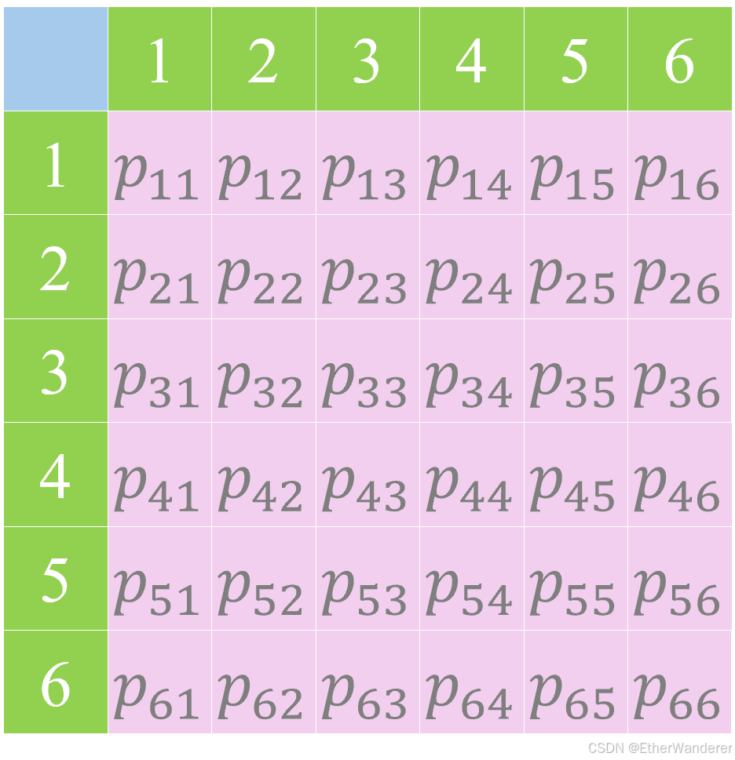
</p>


如果要找点数和为 `6` 的情况，只需要把下标和为 `6` 的格子取出来。它们恰好落在从右上到左下的一条直线上：

<p align="center">
  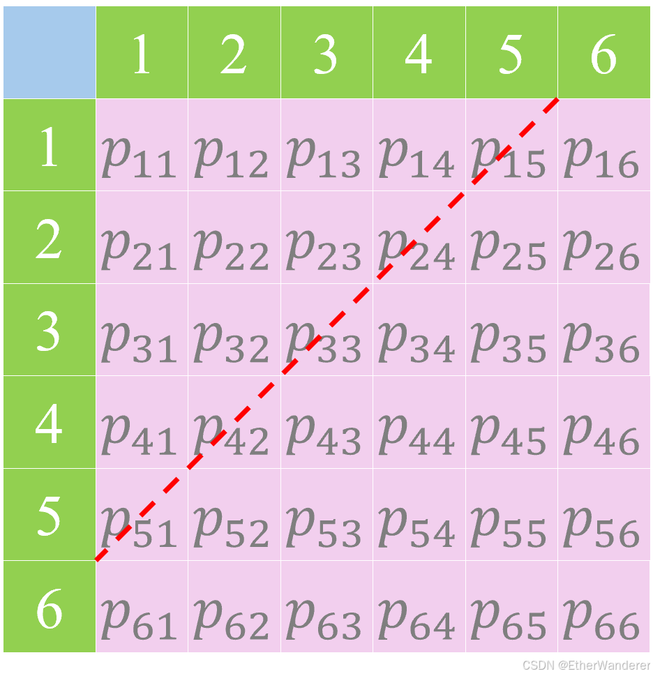
</p>


每个格子的概率，都是两个骰子对应点数概率的乘积，因为两个事件独立。

如果把其中一侧的排列顺序反过来，会更容易看出“滑动求和”的结构：

<p align="center">
  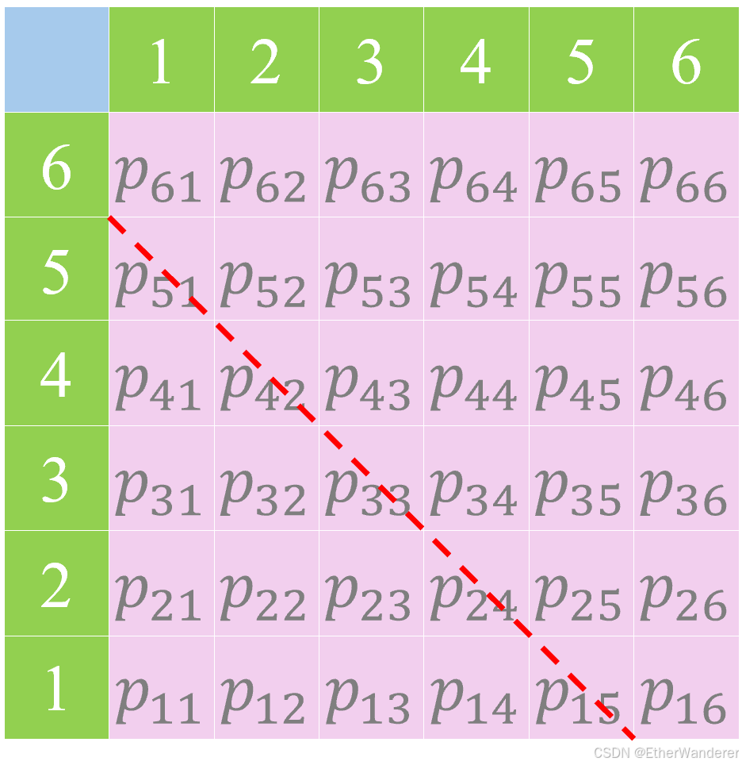
</p>


这样一来，原本的对角线关系就更接近“从左上到右下的滑动窗口”。

<p align="center">
  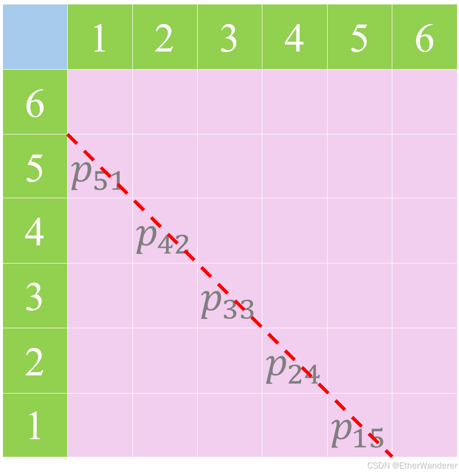
</p>


接下来只保留和当前目标有关的部分，其余位置用空白补齐：

<p align="center">
  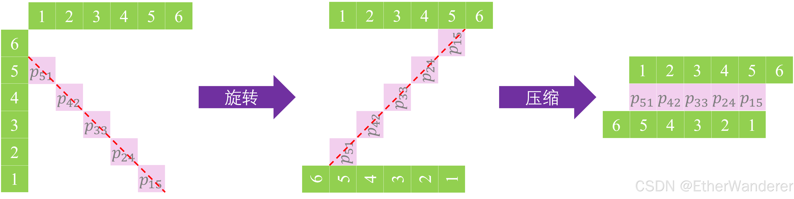
</p>


这时就已经能看到卷积的雏形了。点数和为 `6` 的概率可以写成：
$$
P=p_{51}+p_{42}+p_{33}+p_{42}+p_{51}
$$
如果要求点数和为 `5`，只是把这个窗口继续平移：

<p align="center">
  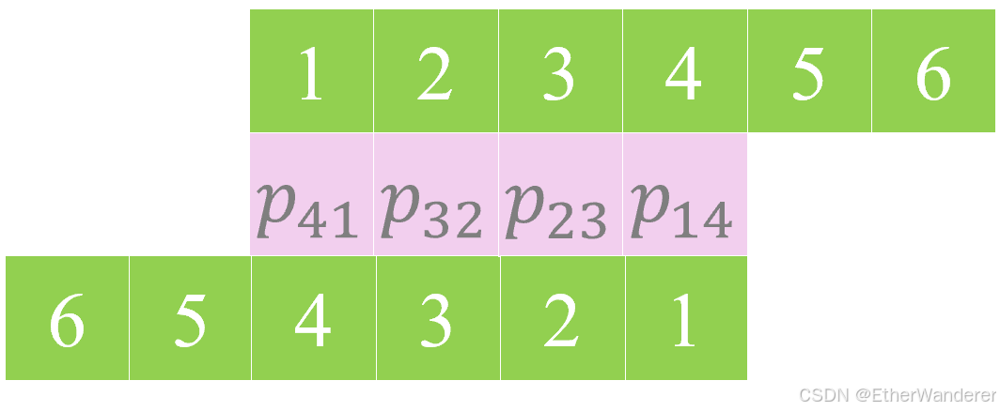
</p>


也就是说，“求点数和的分布”可以理解成“把一个窗口滑过去，并在每个位置做乘积求和”。

如果两个序列长度不同，这个过程也一样成立。滑动示意如下：
<p align="center">
  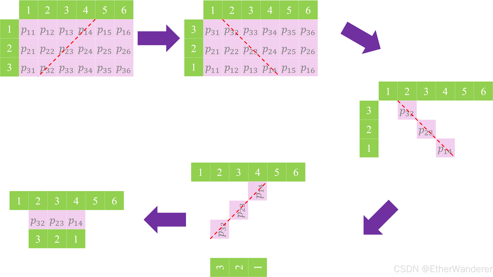
</p>


只需要让小滑块在左右移动即可。遇到边界时，只计算重叠部分。

这就对应到了概率论里的卷积公式：

对于离散型随机变量$X$和$Y$，其概率质量函数分别为$p_X(k)$和$p_Y(k)$，它们的和$Z=X+Y$的概率质量函数$p_Z(k)$为：
$$
p_Z(z)=\sum_kp_X(k)p_Y(z-k)
$$
其中求和遍历所有使 $z-k$ 属于 $Y$ 可能取值范围的 $k$。

### 卷积的初认识

上面的概率例子说明了卷积和“滑动求和”有关。进一步可用一个更接近信号处理的例子建立直觉。

假设有一个数组 `[5, 2, 8, 1, 6, 3, 7, 4, 9, 0]`，它表示一段一维信号：
<p align="center">
  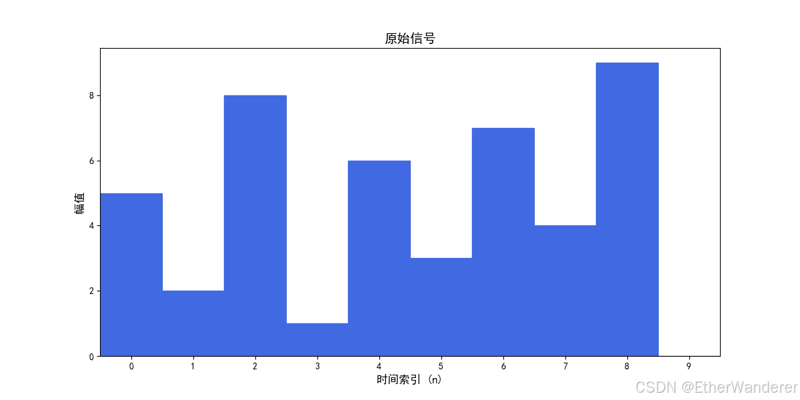
</p>


这组数据波动较大。如果想让它更平滑，可以定义一个简单的卷积核 `[1/3, 1/3, 1/3]`。它的作用，就是在每个位置取一个局部窗口，对邻近值做平均。
<p align="center">
  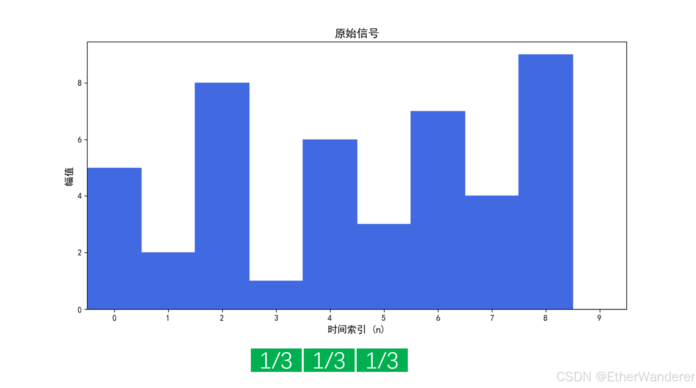
</p>


例如把长度为 `3` 的窗口放到索引 `[3,4,5]` 上，对应位置逐项相乘再求和：

`arr[5] * 1/3 + arr[4] * 1/3 + arr[3] * 1/3 = (3 + 6 + 1) / 3 = 3.333`

这个结果就可以作为新序列中间位置的值。对所有位置重复这个过程，就会得到新的平滑信号。边界之外的部分可视为 `0`：
<p align="center">
  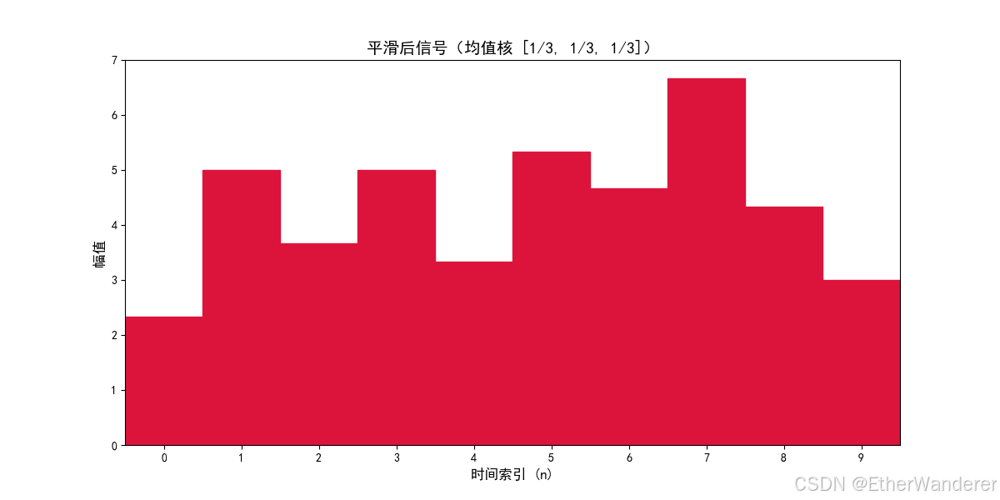
</p>


新信号之所以更平滑，是因为每个位置不再只依赖自身，而是同时参考了邻近位置。这个“滑动窗口”就是卷积核，它决定了局部信息如何被组合。

一维离散卷积的标准形式如下：

对于两个离散序列$x[n]$和$h[n]$,其卷积运算定义为：
$$(y)[n]=(x*h)[n]=\sum_{k=-\infty}^{+\infty}x[k]\cdot h[n-k]$$
在实际应用中，若$x$和$h$分别为长度为$N$和$M$的有限序列，则求和范围被限制在有效区间内，结果序列$y$的长度为$N+M-1$。具体计算时，超出序列范围的项视为零。

还有一个常见细节：严格的数学卷积会涉及卷积核翻转，而很多深度学习库在工程实现里通常直接使用互相关（cross-correlation）的写法。入门时先把它理解为“窗口滑动、逐项相乘、再求和”即可。

下图展示了这种对齐关系：
<p align="center">
  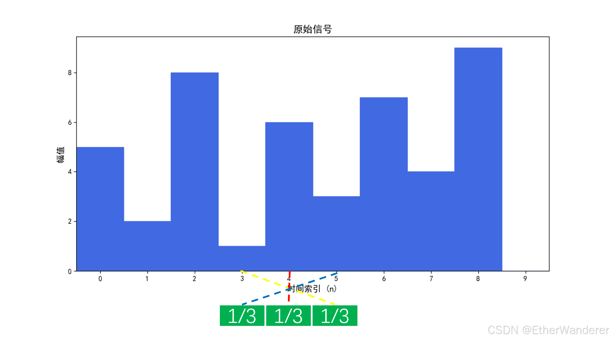
</p>


按照图中的虚线对应关系逐项相乘并累加，就完成了一次卷积运算。

### 二维卷积——图像处理

把这个思路从一维推广到二维，就得到了图像中的卷积操作。

假设有一张二维灰度图像（`1` 表示纯白，`0` 表示纯黑）：
<p align="center">
  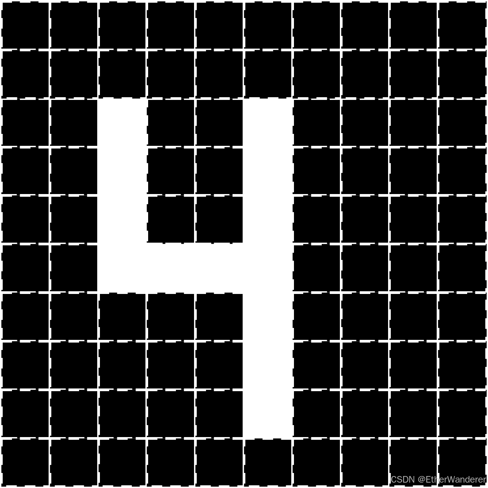
</p>


定义一个和一维情况类似的局部窗口操作：
<p align="center">
  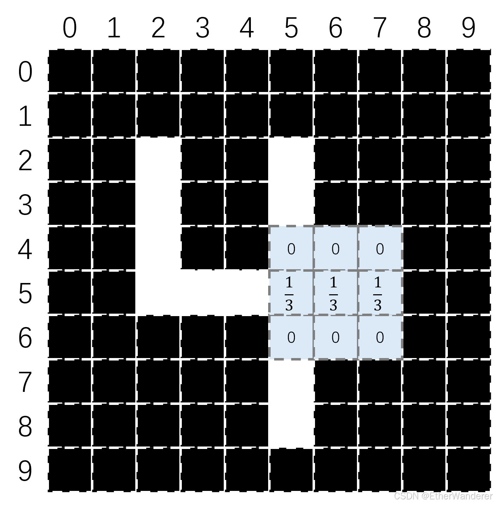
</p>


上图中，`arr[5][6]` 与淡蓝色 `3x3` 方格中心对齐。新的 `arr[5][6]` 值，来自这个局部窗口内逐项相乘再求和。把同样的操作应用到所有位置后，可以得到新的特征图：
> 0.000 0.000 0.000 0.000 0.000 0.000 0.000 0.000
>
> 0.333 0.333 0.333 0.333 0.333 0.333 0.000 0.000
>
> 0.333 0.333 0.333 0.333 0.333 0.333 0.000 0.000
>
> 0.333 0.333 0.333 0.333 0.333 0.333 0.000 0.000
>
> 0.333 0.667 1.000 1.000 0.667 0.333 0.000 0.000
>
> 0.000 0.000 0.000 0.333 0.333 0.333 0.000 0.000
>
> 0.000 0.000 0.000 0.333 0.333 0.333 0.000 0.000
>
> 0.000 0.000 0.000 0.333 0.333 0.333 0.000 0.000

对应可视化如下：
<p align="center">
  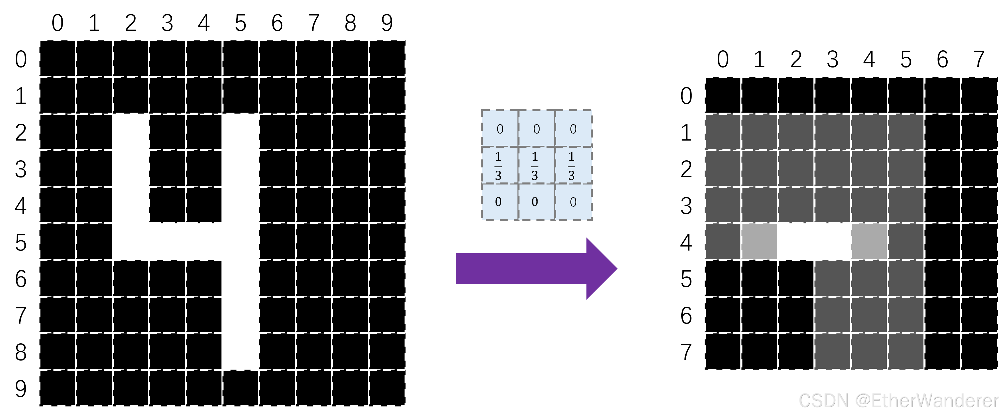
</p>


需要注意的是，卷积后的特征图尺寸变小了。这是因为卷积核在滑动时没有覆盖边缘之外的区域。若希望输入和输出保持同样大小，就需要使用零填充（zero-padding）。例如 `3x3` 卷积核通常需要补一圈像素，`5x5` 卷积核则需要补两圈。

观察卷积后的特征图，原始数字 “4” 的完整形状虽然不再清晰，但局部的横向亮带被强调出来了。这说明卷积层并不是在“记住整张图”，而是在检测局部结构，比如边缘、线段和纹理。

在 CNN 中，一个卷积层通常会并行使用多个卷积核。每个卷积核都可以看成一个不同的局部特征检测器，多层叠加后，模型就能逐步从边缘走向更复杂的形状表示。

需要再强调一次：严格的二维卷积在数学定义里包含卷积核翻转，而深度学习框架中的 `Conv2d` 更接近互相关操作。两者在线性结构上非常相近，不影响对 CNN 核心机制的理解。

$$y[p,q]=\sum_m\sum_nx[m,n]\cdot h[p-m,q-n]$$

其中，$h[p-m,q-n]$表示翻转后的卷积核。

但实际应用中常用如下公式：
$$y[p,q]=\sum_m\sum_nx[m,n]\cdot h[m+p,n+q]$$
或等价地(以更接近卷积的形式表示):
$$y[p,q]=\sum_m\sum_nx[m,n]\cdot h[m-p,n-q]$$


这里没有显式翻转，而是直接平移原卷积核。

## 卷积神经网络

上面已经说明，卷积操作可以更自然地提取图像中的局部空间特征。基于这个思路，就可以把上一篇 MLP 中“直接展平输入”的做法，替换成“先卷积提特征，再做分类”的结构。


```python
import torch
from torchvision import transforms, datasets
from torch import nn
import torch.optim as optim

transform = transforms.Compose([
    transforms.ToTensor(),
    transforms.Normalize((0.1307,), (0.3081,))
])

train_dataset = datasets.MNIST(
    root='./data', train=True, download=True, transform=transform
)

test_dataset = datasets.MNIST(
    root='./data', train=False, download=True, transform=transform
)
```

这里和 MLP 的一个关键区别是：输入不再在一开始就展平。卷积层必须保留图像的二维结构，否则局部空间关系就会丢失。

展平操作并没有消失，只是被推迟到了卷积和池化完成之后，再接入全连接分类层。整体流程如下：
<p align="center">
  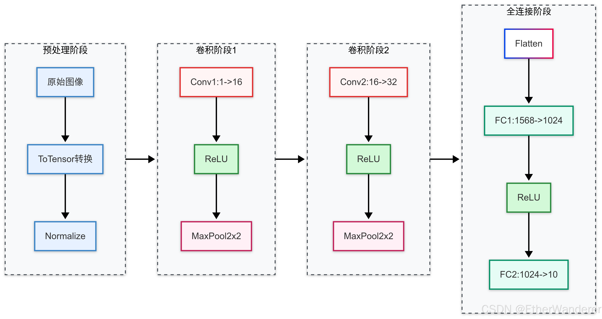
</p>


这里使用两层卷积是一个比较常见的入门配置，目的是在模型复杂度和训练成本之间做一个平衡。数字 `7` 的例子可用于观察中间特征。


输入灰度手写数字7图片
<p align="center">
  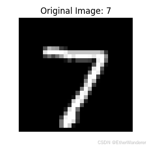
</p>


第一层使用 `16` 个卷积核，因此会得到 `16` 张特征图：
<p align="center">
  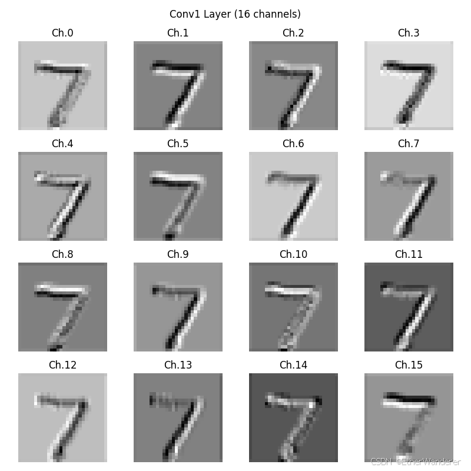
</p>

这里的卷积核不是手工设计的，而是在训练过程中通过反向传播自动学习得到的。不同卷积核会对不同局部模式产生响应，因此得到的特征图也会不同。

得到特征图之后，先施加 ReLU，再进入池化层。

池化（Pooling）负责进一步压缩空间尺寸。以最常见的 `2x2` 最大池化为例，它会在每个局部窗口里保留最大响应：
<p align="center">
  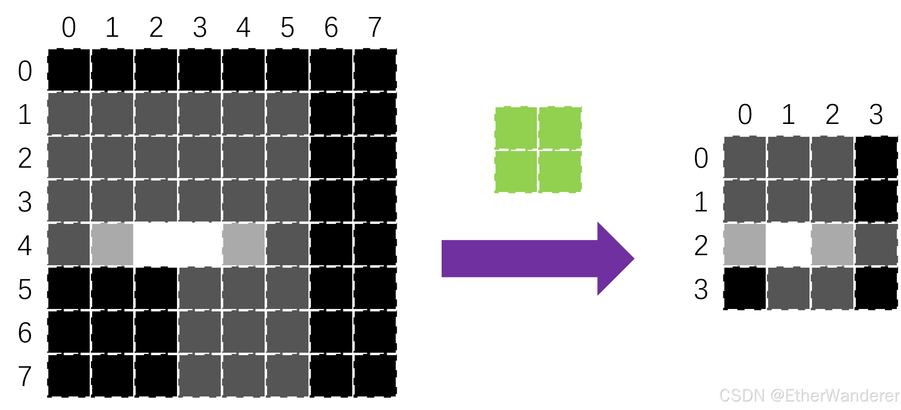
</p>


使用 `2x2` 池化时，特征图的高和宽都会减半，因此空间尺寸会缩小到原来的 `1/4`。这样做既能减少计算量，也能保留局部最显著的响应。

池化后的特征图如下：
<p align="center">
  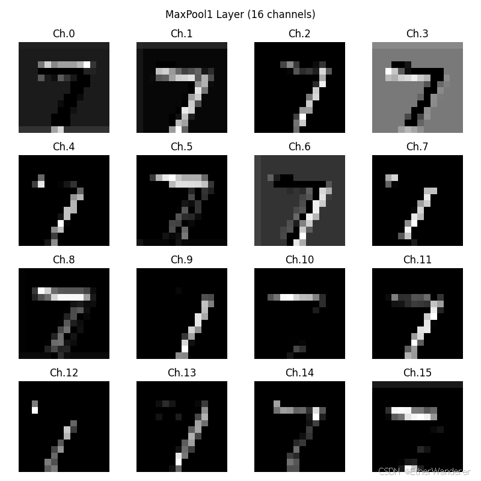
</p>


随后重复相同流程，再做一层卷积。这一层把通道数从 `16` 增加到 `32`：
<p align="center">
  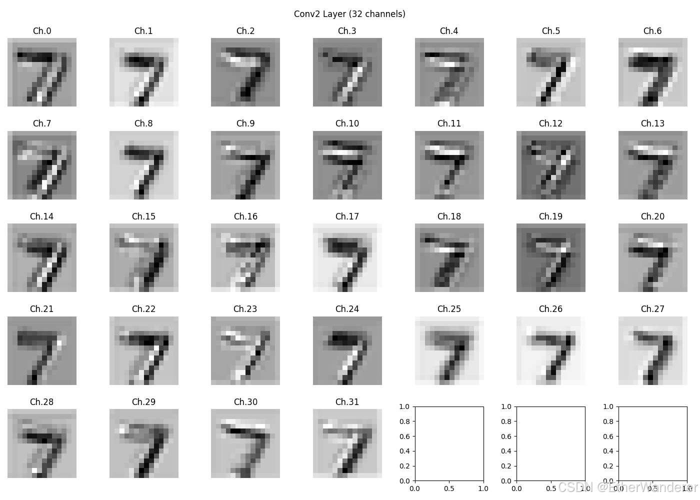
</p>


接着继续通过激活函数，再池化处理，如下图所示：
<p align="center">
  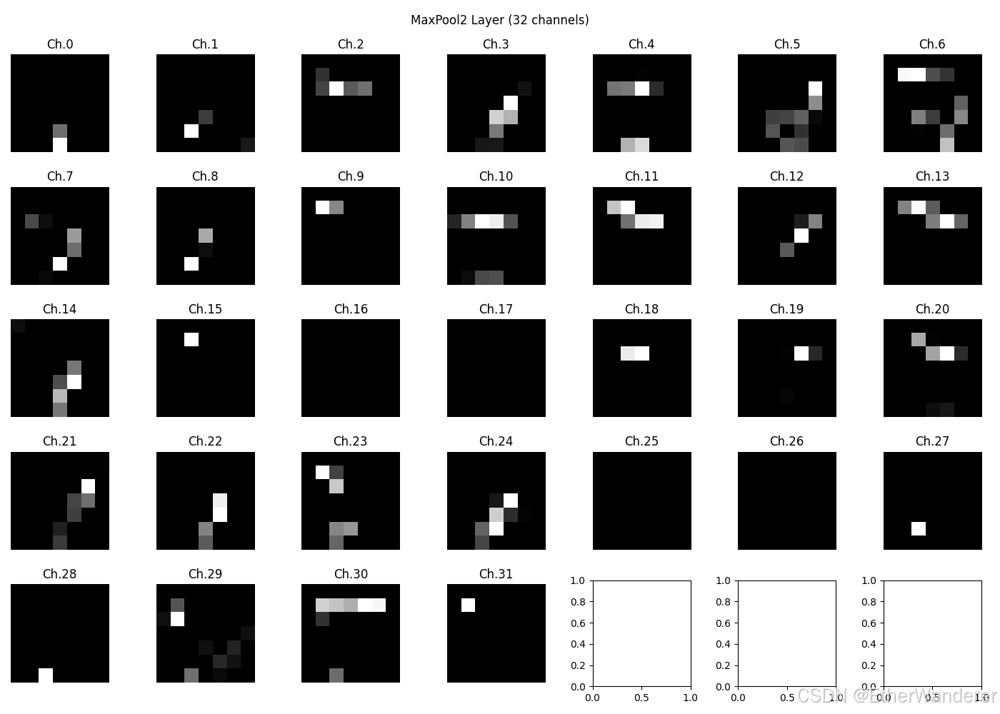
</p>


到这里，特征图虽然已经不像原始数字图像，但其中保留的是更适合分类器使用的高层特征。后续结构与 MLP 类似，接全连接层做分类。


```python
class CNN(nn.Module):
    def __init__(self):
        super(CNN, self).__init__()
        self.conv1 = nn.Conv2d(
            in_channels=1,
            out_channels=16,
            kernel_size=3,
            stride=1,
            padding=1,
        )
        self.relu = nn.ReLU()
        self.pool = nn.MaxPool2d(kernel_size=2)

        self.conv2 = nn.Conv2d(
            in_channels=16,
            out_channels=32,
            kernel_size=3,
            stride=1,
            padding=1,
        )

        self.fc1 = nn.Linear(32 * 7 * 7, 1024)
        self.fc2 = nn.Linear(1024, 10)

    def forward(self, x):
        x = self.conv1(x)
        x = self.relu(x)
        x = self.pool(x)

        x = self.conv2(x)
        x = self.relu(x)
        x = self.pool(x)

        x = x.view(x.size(0), -1)
        x = self.fc1(x)
        x = self.relu(x)
        x = self.fc2(x)
        return x


model = CNN()
```

该模型的结构顺序如下：

1. `conv1 + relu + pool`：提取第一层局部特征并降采样
2. `conv2 + relu + pool`：提取更高层特征并继续降采样
3. `view(...)`：把三维特征图展平
4. `fc1 + relu + fc2`：把卷积提取到的特征映射到分类结果

其中 `32 * 7 * 7` 来自第二次池化之后的特征图尺寸。后续训练流程和上一篇 MLP 非常接近：


```python
device = torch.device('cuda' if torch.cuda.is_available() else 'cpu')
model = model.to(device)

criterion = nn.CrossEntropyLoss()
optimizer = optim.Adam(model.parameters(), lr=0.001)

batch_size = 32

train_loader = torch.utils.data.DataLoader(train_dataset, batch_size=batch_size, shuffle=True)
test_loader = torch.utils.data.DataLoader(test_dataset, batch_size=batch_size, shuffle=False)

num_epochs = 10
for epoch in range(num_epochs):
    model.train()
    for images, labels in train_loader:
        images, labels = images.to(device), labels.to(device)
        optimizer.zero_grad()
        outputs = model(images)
        loss = criterion(outputs, labels)
        loss.backward()
        optimizer.step()
    model.eval()
    correct, total = 0, 0
    with torch.no_grad():
        for images, labels in test_loader:
            images, labels = images.to(device), labels.to(device)
            outputs = model(images)
            _, predicted = torch.max(outputs.data, 1)
            total += labels.size(0)
            correct += (predicted == labels).sum().item()
    print(f"Epoch [{epoch + 1}/{num_epochs}], Test Accuracy: {100 * correct / total:.2f}%")
```

    Epoch [1/10], Test Accuracy: 98.43%
    Epoch [2/10], Test Accuracy: 98.90%
    Epoch [3/10], Test Accuracy: 98.78%
    Epoch [4/10], Test Accuracy: 99.11%
    Epoch [5/10], Test Accuracy: 99.12%
    Epoch [6/10], Test Accuracy: 99.10%
    Epoch [7/10], Test Accuracy: 99.07%
    Epoch [8/10], Test Accuracy: 98.62%
    Epoch [9/10], Test Accuracy: 98.95%
    Epoch [10/10], Test Accuracy: 99.05%
    

相比基础 MLP，这个 CNN 在 MNIST 上通常能达到更高的准确率。这也是因为它更适合处理图像中的局部空间结构。

## 优化算法——Adam

这份实现使用的是 Adam 优化器。相比最基础的 SGD，Adam 会同时跟踪梯度的一阶矩和二阶矩，因此通常更容易在实践中得到稳定训练效果。

它的核心更新量可以写成：

$$m_t = \beta_1 m_{t-1} + (1-\beta_1)g_t$$

$$v_t = \beta_2 v_{t-1} + (1-\beta_2)g_t^2$$

经过偏差修正后，参数更新公式为：

$$\hat{m}_t = \frac{m_t}{1-\beta_1^t}, \quad \hat{v}_t = \frac{v_t}{1-\beta_2^t}$$

$$\theta_{t+1} = \theta_t - \eta \cdot \frac{\hat{m}_t}{\sqrt{\hat{v}_t} + \epsilon}$$

可以把它理解为两件事同时发生：

- 用一阶矩平滑梯度方向，减少震荡
- 用二阶矩估计梯度尺度，自适应调整步长

这也是 Adam 在很多中小型视觉任务里比较常见的原因。

## 小结

这篇笔记从一维卷积的直觉出发，把卷积的核心过程概括为：

- 局部窗口滑动
- 对应位置相乘
- 对结果求和

在图像任务里，这种操作可以更自然地利用空间邻域信息。相比直接展平输入的 MLP，CNN 能更高效地提取边缘、纹理和局部结构，因此在 MNIST 这样的图像分类任务上通常表现更好。

## 代码入口

- `experiments/01-mnist-cnn-experiments/train_cnn.py`：训练入口
- `experiments/01-mnist-cnn-experiments/mnist_experiments/models.py`：CNN 结构定义
- `experiments/01-mnist-cnn-experiments/mnist_experiments/runner.py`：训练主流程
- `experiments/01-mnist-cnn-experiments/mnist_experiments/visualize.py`：预测可视化

## 继续阅读

- 上一章：[01-MLP与MNIST：从数据预处理到最小分类训练](./01-MLP与MNIST：从数据预处理到最小分类训练.md)
- 下一章：[03-CIFAR-10与ResNet：从简单CNN到残差网络](./03-CIFAR-10与ResNet：从简单CNN到残差网络.md)
- 项目速查：[MNIST 实验速查](../experiments/01-mnist-cnn-experiments/README.md)

## 如何运行

```bash
cd experiments/01-mnist-cnn-experiments
pip install -r ../requirements.txt
python train_cnn.py
```
