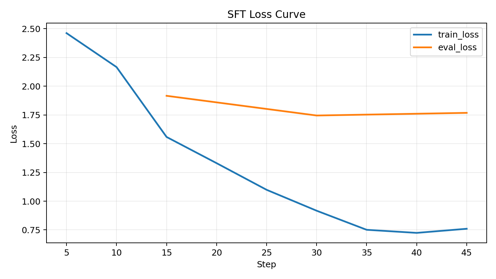

# 指令微调与LoRA：从预训练模型到领域助教

## 本章目标

- 在子词级 GPT 之后，继续补齐基于预训练模型的轻量微调工作流。
- 看懂 `SFT`、`LoRA / QLoRA`、`chat template`、`adapter` 和评测链路在 LLM 项目中的作用。
- 通过领域助教实验建立“底座模型 + 指令数据 + 评测 + demo”是一条完整工程链的直觉。

## 本章实验

- 对应项目：[Notes Assistant SFT 实验速查](../experiments/05-notes-assistant-sft-experiments/README.md)
- 本章聚焦：`notes-assistant-qwen25-0p5b`、`notes-assistant-qwen25-0p5b-smoke`
- 实验产物：JSONL 数据、adapter 权重、训练指标、评测报告和本地 demo

## 关键结果

| 实验 | 数据划分 | 可训练参数占比 | 对照评测结果 | 主要看点 |
| --- | --- | ---: | --- | --- |
| `notes-assistant-qwen25-0p5b` | `240 / 30 / 30` | `8,798,208 / 323,917,696 (2.72%)` | 字符级 F1 `0.285 -> 0.444` | `30` 道 held-out 题里有 `28` 道回答优于基座 |

<p align="center">
  
</p>

正式评测里，微调后的平均字符级 F1 从 `0.285` 提升到 `0.444`，`30` 道 held-out 测试题里有 `28` 道回答优于基座模型。与此同时，严格 exact match 仍然是 `0`，说明这一版的主要收益体现在回答内容更贴近课程笔记，而不是直接生成与参考答案完全一致的表述。

前几章的语言模型主线，重点放在从零实现最小可训练模型：

- 自注意力机制如何建立序列关联
- decoder-only Transformer 如何接成 next-token 训练链路
- 子词级 tokenizer、padding mask 和采样策略如何让流程更接近真实 GPT

这一阶段解决的是“模型如何从空白参数训练起来”。

但在真实项目里，更常见的路径往往不是重新预训练一个更大的模型，而是：

- 先选定一个已经具备通用能力的预训练模型
- 再准备特定任务或特定领域的数据
- 用显存和参数开销更可控的方式完成微调
- 最后把结果落到评测和演示环节

因此，在子词级 GPT 之后，最自然的延伸方向通常不是继续横向增加一个新的 toy 模型，而是补上基于预训练模型的轻量微调工作流。

## 从预训练模型走向指令微调

预训练模型（pretrained model）可以理解成一个已经学会通用语言模式的底座，后续微调的目标不再是“让模型重新学会语言”，而是让它更适合某类输入输出关系。

对于指令模型来说，这种关系通常是：

```text
system
-> user
-> assistant
```

也就是说，模型需要继续学习：

- 面对某类问题时应当采用什么回答结构
- 在特定领域里哪些术语和表达更常见
- 哪些信息应当保留，哪些信息不应当随意扩展

这一阶段最常见的训练方式就是 `SFT`。

## 什么是 SFT

`SFT` 是 `Supervised Fine-Tuning`，也就是监督式微调。

从训练目标看，它仍然是语言模型训练，只是训练样本不再是任意原始文本，而是带有更明确任务结构的指令数据。

把一条聊天样本拼接成一个序列后：

$$
z_1, z_2, \dots, z_T
$$

那么训练目标仍然可以写成：

$$
\mathcal{L} = -\sum_{t=1}^{T}\log P(z_t \mid z_{<t})
$$

也就是说，`SFT` 并没有把语言模型训练改成完全不同的形式，它本质上仍然在优化 next-token 概率。

真正变化的是样本分布：

- 预训练阶段的样本更接近通用文本
- 指令微调阶段的样本更接近“问题如何被回答”

在工程实现里，`SFT` 常见的做法还会进一步把 `system` 和 `user` 部分 mask 掉，只在 `assistant` 对应的 token 上计算损失。这样训练目标会更集中在“回答应该如何生成”，而不是“提示词本身应该如何复述”。

## LoRA 在解决什么问题

如果直接对整个大模型做全参数微调，最直接的代价通常有两类：

1. 显存占用很高
2. 训练和保存成本都偏重

`LoRA` 的核心思想是：不直接更新整个权重矩阵，而是在原有线性层旁边增加一组低秩增量。

假设某个线性层的原始权重为：

$$
W \in \mathbb{R}^{d_{out} \times d_{in}}
$$

那么 `LoRA` 会把更新写成：

$$
W' = W + \Delta W
$$

其中：

$$
\Delta W = BA
$$

并且：

$$
A \in \mathbb{R}^{r \times d_{in}}, \quad B \in \mathbb{R}^{d_{out} \times r}, \quad r \ll \min(d_{in}, d_{out})
$$

这样做的结果是：

- 原模型的大部分参数保持冻结
- 真正需要训练的只是一组较小的低秩矩阵
- 保存出来的也不再是完整模型，而是一份更轻的 adapter

从工程视角看，`LoRA` 把“重新训练一个完整模型”转成了“在既有底座上叠加一个任务增量”。

## QLoRA 又补了什么

只有 `LoRA` 还不够，因为底座模型本身仍然可能很大。

`QLoRA` 的进一步思路是：

- 底座模型用更低比特方式加载
- LoRA 增量仍然保持可训练
- 训练时只更新 adapter，而不回写全部底座权重

这样一来，显存压力会继续下降。

如果把两者的分工压缩成一句话：

- `LoRA` 关注“哪些参数需要训练”
- `QLoRA` 关注“底座模型如何以更低成本被加载进训练流程”

这也是本地单卡实验里常见的组合方式。

## chat template 为什么不能忽略

在指令微调里，数据并不是随意拼接的文本块，而是带角色结构的消息序列。

很多指令模型都已经约定了自己的输入格式，例如：

- `system`
- `user`
- `assistant`

这些角色、边界标记和拼接方式，就是常说的 `chat template`。

如果训练时使用的模板与推理时不一致，常见问题包括：

- 回答风格不稳定
- 角色边界重复输出
- 模型无法准确识别从哪里开始生成回答

因此，`chat template` 在指令微调里并不是一个可有可无的格式细节，而是训练数据和推理数据能否对齐的关键部分。

## 为什么只在 assistant 段计算损失

对话样本通常包含三类内容：

- system 提示
- user 提问
- assistant 回答

整段都纳入损失时，模型会被同时要求学习：

- 如何复述系统提示
- 如何复述用户问题
- 如何生成回答

这并不是最理想的训练重点。

更常见的做法是：

- `system` 和 `user` 部分仍然参与上下文输入
- 但在 labels 里把这些位置设为 `ignore_index`
- 只让 `assistant` 对应的 token 真正参与交叉熵计算

这样训练目标会更接近“给定提示后，回答应该长成什么样”。

## adapter 到底是什么

完成 LoRA 训练之后，通常不会得到一份完整重写后的大模型权重。

更常见的产物是：

- 原始底座模型
- 一组 adapter 参数

推理时的实际路径通常是：

```text
base model
-> load adapter
-> merged forward behavior
-> generation
```

也就是说，adapter 更像一份任务增量，而不是一个从零独立存在的新模型。

这也是 LoRA 系列方法非常适合实验和项目化整理的原因：

- 训练成本相对更低
- 权重体量更小
- 同一个底座可以复用多个任务 adapter

## 训练数据为什么要保留来源字段

这一章对应实验里的数据格式是 JSONL，每条样本至少包含：

- `instruction`
- `input`
- `output`
- `source_chapter`
- `source_section`
- `split`

其中前三项负责训练本身，后三项更多是在为工程化流程服务。

保留来源字段的好处主要有两个：

1. 可以回查某条样本来自哪一章、哪一节
2. 可以在评测和人工复核时快速定位模型到底学到了什么内容

当数据来自课程笔记而不是公开通用指令集时，这种可追溯性尤其重要。

## 评测为什么要保留基座模型对照

完成微调之后，最直观的检查方式当然是直接看生成结果。

但如果没有对照组，很多现象并不容易解释：

- 回答变长了，但未必更准确
- 术语更集中出现了，但未必更贴近笔记
- 风格更像助教了，但未必信息密度更高

因此更稳妥的评测方式通常会同时保留：

- held-out 测试题
- 基座模型回答
- 微调后模型回答
- 自动指标和人工复核结果

这样才能更清楚地区分：

- 模型是否真的更贴近目标领域
- 变化来自 adapter 还是本来就存在于底座模型
- 哪些收益来自风格约束，哪些收益来自知识覆盖

## 代表样例

如果把自动指标继续拆开看，可以看到不同题型上的变化并不一致。下面选取 4 组代表性对照，分别对应代码入口定位、章节位置判断、概念解释和要点总结这四类问题。前 3 组更容易看出微调后回答开始贴近仓库结构和课程笔记的组织方式，最后 1 组则保留了当前版本仍然明显存在的边界。

### 1. 代码入口定位

**问题**

```text
如果我想把“二维卷积——图像处理”落到当前仓库里的实验代码，应该先看哪里？

回答时请给出目录或文件入口，并说明为什么。
```

**参考要点**

```text
这一题的关键，不是泛泛解释二维卷积，而是把概念落到仓库里的真实入口。更合理的回答应该先返回 experiments/01-mnist-cnn-experiments 下的训练入口，再指出对应的模型实现位置，并说明这一节真正关联的是“局部窗口 + 参数共享”如何落进卷积层。
```

**基座模型回答**

```text
1. 了解“二维卷积——图像处理”的基本概念和实现方法。
2. 查找与“二维卷积——图像处理”相关的开源代码库。
3. 确认这些代码是否满足你的需求，例如是否使用了特定的库、框架或算法。

目录：
- 第一章：理解“二维卷积——图像处理”
  - 介绍二维卷积的基本原理
  - 二维卷积在图像处理中的应用
  - 二维卷积的实现方法

目录：
- 第二章：选择开源代码库
  - 选择一个与“二维卷积——图像处理”相关的开源代码库
  - 选择理由：确保代码满足你的需求，例如是否使用了特定的库、框架或算法

目录：
- 第三章：验证代码
  - 验证代码是否满足你的需求
  - 通过检查函数、变量、注释等来验证代码是否正确实现

目录：
- 第四章：总结
  - 总结本章内容
  - 说明如何将“二维卷积——图像处理”应用于实际问题

目录：
- 第五章：参考资料
  - 提供其他关于“
```

**微调后回答**

```text
如果要把这一节落到代码，建议先看 experiments/01-mnist-cnn-experiments 下的 train_cnn.py 跑通入口，再结合 experiments/01-mnist-cnn-experiments/mnist_experiments/models.py 理解这一节真正影响的是哪一段实现。对应到当前小节，最值得带着代码去验证的是：假设有一张 28x28 的灰度图像，可以把它想象成一个二维网格。接下来，我们希望用一个卷积核（kernel）把它分割成多个局部窗口。 对于每个窗口，都需要计算其特征空间直觉： 这里使用的是一个 3*3 的卷积核，它会保留图像中靠近边缘的局部模式。 把它放回《二维卷积——图像处理》这章里看，这一步相当于把“提取局部模式”从概念直觉推进到更具体的实现或训练问题。
```

这一组样例最直接地体现了领域约束的作用。基座模型停留在通用化的检索建议上；微调后回答已经能返回仓库内的真实入口，并开始沿用课程笔记里“从概念到代码”的展开方式。

### 2. 章节位置判断

**问题**

```text
“用一个熟悉的类比理解机器学习流程”在《MLP 与 MNIST：从数据预处理到最小分类训练》这一章的学习顺序里处在什么位置？

请回答它承接什么、又为后面什么内容做准备。
```

**参考要点**

```text
这一题考查的不是术语解释，而是章节内部的位置关系。更合理的回答应该先指出这一节承接的是“关键结果”后的整体引入，再说明它为后面的数据预处理和训练实现建立直觉上的过渡。
```

**基座模型回答**

```text
“用一个熟悉的类比理解机器学习流程”在《MLP 与 MNIST：从数据预处理到最小分类训练》这一章的学习顺序里处在以下位置：

1. 介绍机器学习的基本概念和目标。
2. 讲解数据预处理（如清洗、分割、标准化）的过程。
3. 分析数据预处理对模型性能的影响。
4. 探讨数据预处理如何影响模型的泛化能力。

接下来，它为后面的内容做准备：

5. 引入最小分类训练的概念。
6. 解释最小分类训练的目标。
7. 讲解最小分类训练是如何实现的。
8. 分析最小分类训练对模型性能的影响。
9. 探索最小分类训练如何影响模型的泛化能力。
```

**微调后回答**

```text
它承接了前面的“MNIST 的特征和分类问题”，也为后面的“为什么 MLP 会这么写”做准备。具体来说，这一节主要强调：假设有一组数据： X1, X2, X3, …, Xn，其中每个点都表示一张图片。如果想把它建成一个模型，第一步应该把数据拆成样本： x1 = (x1_1,x1_2), x2 = (x2_1,x2_2), x3 = (x3_1,x3_2), … 这样做的好处是： 每个样本都有一个标签，可以方便地进行训练和评估。 模型结构更直观，训练过程也更容易理解。 如果把这组数据放回原形，最直观的直觉就是：先按类别分组，再逐个训练分类器。 所以它不是孤立知识点，而是本章学习顺序里的一个过渡节点。
```

这一题能看出回答结构已经开始接近课程笔记的写法。微调后模型学会了“承接前文 / 为后文做准备”这类章节组织句式，但具体承接关系和举例内容仍然会发生漂移。

### 3. 概念解释

**问题**

```text
请解释“用一个熟悉的类比理解机器学习流程”的核心含义，并说明它在这一章里解决什么问题。

章节：MLP 与 MNIST：从数据预处理到最小分类训练
```

**参考要点**

```text
这一题真正需要回答的是“这段类比在本章里解决什么问题”。参考答案通常会围绕两点展开：一是说明为什么要用熟悉经验帮助初学者建立训练流程直觉，二是交代这段内容在整章里承担的是从概念引入走向具体实现的过渡作用。
```

**基座模型回答**

```text
用一个熟悉的类比理解机器学习流程

核心含义：将复杂的、抽象的机器学习概念与熟悉的事物或现象进行类比，帮助理解复杂系统的工作原理和操作过程。

问题：解决的问题：通过类比，使学生能够更好地理解如何使用MLP（多层感知器）和MNIST（用于图像识别的神经网络）来实现数据预处理、特征选择、模型训练和评估等步骤，从而提高他们的学习效率和理解能力。
```

**微调后回答**

```text
“用一个熟悉的类比理解机器学习流程”这一节主要在讲：如果把模型比作一台车，那么训练过程可以看成驾驶台上的操作。具体来说，每次迭代时，都会从当前最优解开始，通过修正量更新参数，然后根据损失函数评估效果，决定下一次应该往哪个方向改进。 这里的“驾驶台”和“参数”都是常见的概念，而“操作”和“评估效果”则是更具体的实现细节。 所以它不是孤立知识点，而是本章里一个重要的学习目标。
```

这一组样例对应的是“概念解释是否真正贴住章节语境”。基座模型停留在泛泛的“类比有助于理解”层面；微调后回答开始尝试把解释拉回训练流程，但和参考答案相比仍然存在明显偏移。

### 4. 要点总结

**问题**

```text
总结《MLP 与 MNIST：从数据预处理到最小分类训练》里“用一个熟悉的类比理解机器学习流程”这部分的关键要点。

请尽量用精炼的条目回答。
```

**参考要点**

```text
这类问题更适合压缩成几个稳定要点：
1. 用熟悉类比先建立对训练流程的整体直觉。
2. 这个类比并不要求严格映射数学定义，重点是先理解主线。
3. 它为后面的数据预处理、模型训练和评估内容提供认知上的铺垫。
```

**基座模型回答**

```text
1. 通过使用一个熟悉的类比理解机器学习流程，我们可以将复杂的问题分解为更简单、更直观的部分。
2. 这种方法有助于提高理解和应用机器学习算法的效率。
3. 通过将复杂的任务拆解为一系列简单的步骤，我们可以更容易地理解和实施机器学习技术。
```

**微调后回答**

```text
这部分可以先抓住下面 3 点：
1. 如果把 MNIST 中的每张图片都想象成一个标签，那么模型的任务就是尽可能准确地预测每张图片应该属于哪个类别。
2. 这里的“每张图片”和“类别”是近似的，但两者在概念上是等价的。
3. 因此训练的目标可以写成：最大化分类损失 + 目标概率最大化。
```

这一题更能暴露当前版本的边界。微调后回答已经进入课程语境，但仍会捏造目标形式和训练目标，因此这一版更适合作为复习辅助，而不是直接替代原文。

## 本章实验在做什么

这一章对应的实验，把 `notes/01-06` 视为一个小型领域知识源，先自动生成问答型指令数据，再在轻量指令模型上执行 `SFT + LoRA / QLoRA`。

主流程可以压缩成：

```text
notes/01-06
-> JSONL instruction data
-> chat template formatting
-> supervised fine-tuning
-> adapter export
-> base vs finetuned evaluation
-> local demo
```

和前一章子词级 GPT 相比，这里的重点不再是继续扩展最小模型结构，而是把已有的语言模型直觉接到真实项目更常见的工具链上：

- 预训练模型加载
- 指令数据构建
- 轻量微调
- 对照评测
- 本地演示

## 小结

从最小字符级 Transformer 到子词级 GPT，重点在于理解语言模型如何从零训练起来。

再往前走一步，基于预训练模型的指令微调则补上了另一条工程主线：

- 如何准备结构化指令数据
- 如何通过 `LoRA / QLoRA` 控制训练成本
- 如何用统一的 `chat template` 对齐训练和推理
- 如何把 adapter、评测和 demo 组织成一条完整流程

由此，语言模型的理解范围就不再只覆盖“最小模型如何实现”，还会继续扩展到“真实项目里，轻量微调流程如何落地”。

## 代码入口

- `experiments/05-notes-assistant-sft-experiments/prepare_dataset.py`：数据构建入口
- `experiments/05-notes-assistant-sft-experiments/train_sft.py`：训练入口
- `experiments/05-notes-assistant-sft-experiments/evaluate_qa.py`：评测入口
- `experiments/05-notes-assistant-sft-experiments/launch_demo.py`：演示入口
- `experiments/05-notes-assistant-sft-experiments/notes_assistant_experiments/dataset_builder.py`：笔记解析与数据生成
- `experiments/05-notes-assistant-sft-experiments/notes_assistant_experiments/train.py`：LoRA / QLoRA 主流程

## 继续阅读

- 上一章：[06-子词级GPT：从BPE到更像真实LLM的训练流程](./06-子词级GPT：从BPE到更像真实LLM的训练流程.md)
- 项目速查：[Notes Assistant SFT 实验速查](../experiments/05-notes-assistant-sft-experiments/README.md)

## 如何运行

```bash
cd experiments/05-notes-assistant-sft-experiments
pip install -r ../requirements.txt
python prepare_dataset.py --overwrite
python train_sft.py
```

小规模冒烟验证：

```bash
python train_sft.py --smoke
```

对比评测：

```bash
python evaluate_qa.py --run-dir outputs/notes-assistant-qwen25-0p5b
```

启动本地 Demo：

```bash
python launch_demo.py --run-dir outputs/notes-assistant-qwen25-0p5b
```
