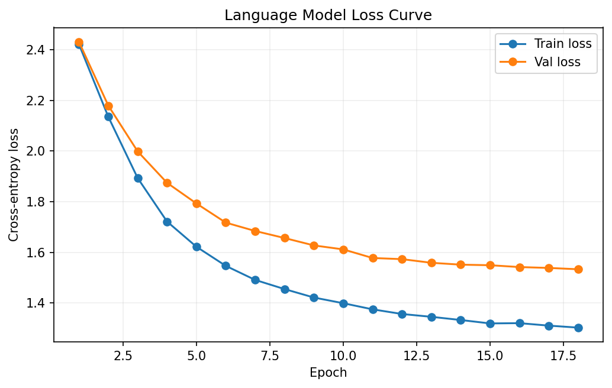

# Character Transformer Experiments

这个项目围绕字符级语言建模任务实现了两个核心模型版本，并在同一条实验线上持续迭代：

- `bigram`：最小 next-token baseline，只根据当前位置字符预测下一个字符
- `transformer`：带位置编码、masked multi-head self-attention、FFN、LayerNorm 的 decoder-only Transformer

这个项目的目标不是追求大规模生成效果，而是把 Transformer 语言模型最核心的一条实现主线真正落下来：

- 从离散字符构建词表和 embedding
- 引入位置编码
- 用 causal mask 约束自回归训练
- 堆叠多头注意力和前馈网络
- 输出验证集 loss、perplexity 和生成文本样例

## 第一版定位

`bigram` 版本的特点：

- 模型极小
- 训练逻辑清晰
- 适合作为语言模型入门基线

它基本不具备长距离建模能力，但非常适合回答一个起步问题：

如果只保留“根据当前字符预测下一个字符”这个最小目标，训练和生成代码应该怎么组织？

## 第二版定位

`transformer` 版本在 `bigram` 的基础上补齐了最关键的模块：

- `token embedding`
- `learned positional embedding`
- `masked multi-head self-attention`
- `feed-forward network`
- `residual connection + LayerNorm`
- `warmup + cosine decay`
- `gradient clipping`

目标是把“知道自注意力公式”推进到“自己能写出一个最小可训练的 Transformer 语言模型”。

## 当前结果

以下结果来自 `2026-04-11` 本地 CUDA 环境的实际运行产物：

| Variant            | Epochs | Batch Size | Block Size | Params    | Best Val Loss | Best Val Perplexity | Notes                                                  |
| ------------------ | -----: | ---------: | ---------: | --------: | ------------: | ------------------: | ------------------------------------------------------ |
| bigram             |      4 |         64 |         64 |     4,225 |        2.5441 |               12.73 | 最小字符级 baseline，主要学习局部字符共现模式         |
| transformer        |      8 |         64 |        128 |   826,433 |        2.1182 |                8.32 | 第一版 Transformer，已经能学习对白格式和换行结构      |
| transformer v2     |     12 |         48 |        192 | 2,286,593 |        1.6733 |                5.33 | 扩大上下文和模型容量后，生成质量明显提升               |
| transformer v3     |     18 |         48 |        192 | 2,286,593 |        1.5333 |                4.63 | 保持模型规模不变，继续延长训练后进一步提升文本质量    |

## 迭代对比

| Stage              | Change Summary                                              | Best Val Loss | Best Val Perplexity |
| ------------------ | ----------------------------------------------------------- | ------------: | ------------------: |
| `bigram`           | 只保留最小 next-token 查表基线                              |        2.5441 |               12.73 |
| `transformer`      | 加入位置编码、多头注意力、FFN、LayerNorm 和 warmup/cosine    |        2.1182 |                8.32 |
| `transformer v2`   | 提升 `block_size`、`embedding_dim`、层数，并延长训练          |        1.6733 |                5.33 |
| `transformer v3`   | 保持 `v2` 结构，降低 dropout、拉长训练轮数和每轮训练步数      |        1.5333 |                4.63 |

对比结论：

- `transformer` 相比 `bigram`，验证集 loss 从 `2.5441` 降到 `2.1182`
- `transformer v2` 相比第一版 `transformer`，验证集 loss 进一步从 `2.1182` 降到 `1.6733`
- `transformer v3` 相比 `transformer v2`，验证集 loss 进一步从 `1.6733` 降到 `1.5333`
- `transformer v3` 相比 `bigram`，perplexity 从 `12.73` 降到 `4.63`
- `bigram` 的生成文本主要体现局部字符统计规律，长距离结构明显不足
- 第一版 `transformer` 已经能学到 Shakespeare 风格对白的排版与局部句式
- `transformer v2` 的文本连贯性、单词完整度和多行结构都明显优于第一版
- `transformer v3` 在角色名格式、对白组织和句子连贯性上继续优于 `v2`

## 收敛曲线

下面这张图来自受版本控制的精选实验资源，用来观察 `transformer v3` 的训练集 / 验证集 loss 下降趋势：



从这次运行可以看到：

- 验证集 loss 基本持续下降，没有明显反弹
- 到最后几轮仍然保持缓慢下降，说明继续训练还有一定空间
- 训练集和验证集之间有间隔，但没有出现特别明显的过拟合

## 生成样例对比

下面使用同一个 prompt：

```text
ROMEO:
```

对比四版模型的生成结果。

`bigram`

```text
ROMEO:
I
O: asaRE:
NDUp, te othut mWdXFarnd he, preckn,

Henthimav--wishelapiwisers we s, oreanotstheluprt,cody inde eveR:
PEdVImangENofowhas
```

`transformer`

```text
ROMEO:
Cand tal gin compowlles ave your my now thaten;
I isen lest to chene orer for lige the our wild
With the thal than wil forde head come.

KING HOUCHHINTG ERD:
Nou cof tou shis andsie his and of bust ist thee tofer.
```

`transformer v2`

```text
ROMEO:
Nare counseln to the the contining course
That make still see take with thee are and
Through is will it fair; like it courself all
That day's in my wrange that the with pity to death.

BRUTUS:
I do and I dispore well, I must one hither be to York
```

`transformer v3`

```text
ROMEO:
How! 'Tis this king.

Second Murder:
The king the court? 'Tis not too some much speed.

MENENIUS:
Why, for Warwick!

POMPEY:
There one love me from that's benefit?
```

从样例上看：

- `bigram` 主要只学到了局部字符拼接规律
- 第一版 `transformer` 已经开始学到对白体裁、换行和角色名格式
- `transformer v2` 虽然仍然不完全通顺，但句子形状、单词完整度和段落结构都更接近真实文本
- `transformer v3` 已经能更稳定地输出角色名、对白轮换和更像句子的英文片段

## 运行

```bash
pip install -r ../requirements.txt
python train_bigram.py
python train_transformer.py
python generate_samples.py --run-dir outputs/tinyshakespeare-transformer-v3 --temperatures 0.6 0.75 0.9
```

也可以先跑更轻量的开发配置：

```bash
python train_bigram.py --epochs 2 --steps-per-epoch 20 --eval-steps 5 --experiment-name bigram-dev
python train_transformer.py --epochs 2 --steps-per-epoch 20 --eval-steps 5 --block-size 64 --embedding-dim 64 --num-heads 4 --num-layers 2 --experiment-name transformer-dev
```

默认情况下，如果 `data/` 下不存在语料文件，程序会自动下载 `tiny Shakespeare` 文本并缓存到本地。

训练完成后，也可以单独读取某次实验目录里的 `best_model.pt` 和 `config.json`，批量导出不同 `temperature` 下的生成样例。默认会把结果写到 `<run-dir>/temperature_sweep.txt`。

推荐：

- 直接在 `projects/03-char-transformer-experiments/` 目录下运行命令
- 即使从仓库根目录启动，默认数据和输出现在也会落到当前项目目录，不会再污染仓库根目录

## 输出文件

每次运行都会写入 `outputs/<experiment-name>/`：

- `config.json`：本次实验配置
- `metrics.json`：训练历史、最佳验证损失、最终 perplexity
- `best_model.pt`：最佳 checkpoint
- `samples.txt`：给定 prompt 后的生成文本样例
- `loss_curve.png`：训练集 / 验证集 loss 曲线
- `temperature_sweep.txt`：使用 `generate_samples.py` 导出的多温度文本对比

说明：

- `data/` 和 `outputs/` 都是本地运行时生成目录，默认不提交到仓库
- 共享依赖文件位于 `../requirements.txt`

## 项目结构

```text
03-char-transformer-experiments/
├─ data/                               # local, gitignored
├─ char_transformer_experiments/
│  ├─ cli.py
│  ├─ config.py
│  ├─ data.py
│  ├─ engine.py
│  ├─ generate.py
│  ├─ models.py
│  ├─ runner.py
│  ├─ utils.py
│  └─ visualize.py
├─ outputs/                            # local, gitignored
├─ generate_samples.py
├─ train_bigram.py
├─ train_transformer.py
└─ ../requirements.txt                 # shared dependency file
```

## 源码职责

- `train_bigram.py`：bigram 基线入口
- `train_transformer.py`：Transformer 训练入口
- `generate_samples.py`：加载已训练 checkpoint，导出不同 temperature 的文本样例
- `char_transformer_experiments/data.py`：语料下载、词表构建、随机子序列采样
- `char_transformer_experiments/generate.py`：temperature sweep 生成逻辑
- `char_transformer_experiments/models.py`：bigram / transformer 模型定义
- `char_transformer_experiments/engine.py`：训练循环、验证损失估计、学习率调度
- `char_transformer_experiments/runner.py`：实验编排、checkpoint 保存、样例文本导出
- `char_transformer_experiments/visualize.py`：loss 曲线保存

## 默认配置

`bigram`

- 优化器：`Adam`
- 学习率：`0.01`
- 训练轮数：`4`
- `block_size`：`64`

`transformer`

- 优化器：`AdamW`
- 学习率：`3e-4`
- 最小学习率：`3e-5`
- 训练轮数：`8`
- `block_size`：`128`
- `embedding_dim`：`128`
- `num_heads`：`4`
- `num_layers`：`4`
- `dropout`：`0.2`
- 学习率调度：`warmup + cosine decay`

## 工程说明

- 训练样本不是固定文件列表，而是从长文本中随机截取长度为 `block_size` 的连续片段
- 评估指标以 `val_loss` 和 `perplexity` 为主，不再使用分类准确率
- 文本生成阶段会从给定 prompt 自回归采样，并将结果保存到 `samples.txt`
- 额外的采样分析可以通过 `generate_samples.py` 导出到 `temperature_sweep.txt`
- 这个项目适合作为后续继续扩展到词级 tokenization、Transformer 分类器或小型 GPT 实验的基础骨架
