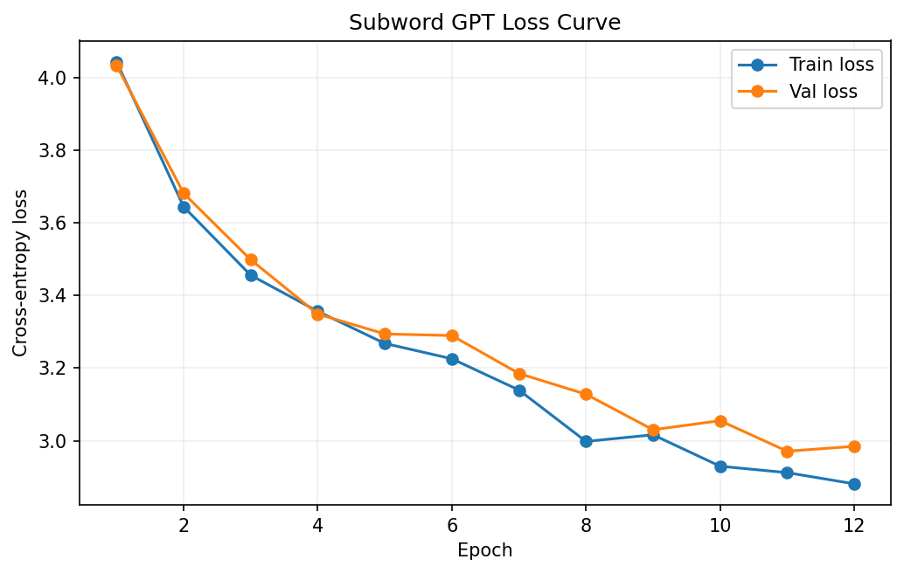

# 子词级 GPT 实验

这个项目是在字符级 Transformer 之后的下一站：目标不再只是“写出一个最小 Transformer”，而是补上更接近真实 GPT 工作流所需要的关键部件。

## 项目定位

- 使用 `byte-level BPE` 从原始文本训练 tokenizer。
- 显式引入 `<pad> / <bos> / <eos>`。
- 训练 `decoder-only GPT`，保留因果掩码。
- 在训练与评估阶段处理 `padding mask`。
- 在生成阶段支持 `temperature + top-k + top-p`。

换句话说，这个项目重点展示的是“工程形态升级”，而不只是单纯追更低的困惑度。

## 核心结果

| 运行名 | 设备 | 词表大小 | 参数量 | 最佳验证损失 | 最佳验证困惑度 | 说明 |
| --- | --- | ---: | ---: | ---: | ---: | --- |
| `tinyshakespeare-subword-gpt-v1` | CUDA | 512 | 6,490,624 | `2.9711` | `19.51` | 正式训练结果，最佳点出现在第 11 轮 |
| `smoke-subword-gpt` | CPU | 300 | 121,344 | `5.6604` | `287.27` | 用于链路冒烟验证 |

这条线最值得看的不是单个数字，而是它补上的能力：

- tokenizer 从字符级切到了子词级
- 训练流程开始处理 variable-length batch 与 padding
- 生成控制开始接近真实 LLM 常见工作流

## 精选展示



这张曲线保留了最值得公开展示的正式训练结果，而不是把完整输出目录和权重一起放进仓库。

## 生成样例摘录

下面这段摘自 `subword-gpt v1` 在 `temperature = 0.6` 时的生成结果：

```text
ROMEO:
Should been not so'er, but sweet they well.

ROMEO:
He will he is parte: what is it what bet?
```

这说明模型已经开始进入“短句可读但仍明显不稳定”的阶段。

和字符级 `transformer v3` 相比：

- 字符级模型在当前设置下生成质量更成熟
- 子词级模型的核心价值在于工程范式更接近真实 GPT

## 如何运行

```bash
pip install -r ../requirements.txt
python train_gpt.py
```

如果想导出不同温度下的生成结果：

```bash
python generate_samples.py --run-dir outputs/<experiment-name> --temperatures 0.6 0.8 1.0 --top-k 40 --top-p 0.95
```

运行后会在本项目目录下自动生成：

- `data/`：语料与 tokenizer 文件
- `outputs/<experiment-name>/`：配置、指标、最佳权重、生成样例和 loss 曲线

这些目录默认仅用于本地运行，不纳入版本控制。

## 代码结构

```text
04-subword-gpt-experiments/
├─ subword_gpt_experiments/
│  ├─ cli.py
│  ├─ config.py
│  ├─ data.py
│  ├─ engine.py
│  ├─ generate.py
│  ├─ models.py
│  ├─ runner.py
│  ├─ tokenizer.py
│  ├─ utils.py
│  └─ visualize.py
├─ generate_samples.py
└─ train_gpt.py
```

## 延伸阅读

- 理论与实现说明见：[05-子词级GPT：从BPE到更像真实LLM的训练流程](../../notes/05-子词级GPT：从BPE到更像真实LLM的训练流程.md)
- 和字符级模型的并排比较见：[实验结果总览](../../docs/实验结果总览.md)
- 如果想先理解最小 Transformer 骨架，建议先看：[字符级 Transformer 实验](../03-char-transformer-experiments/README.md)
