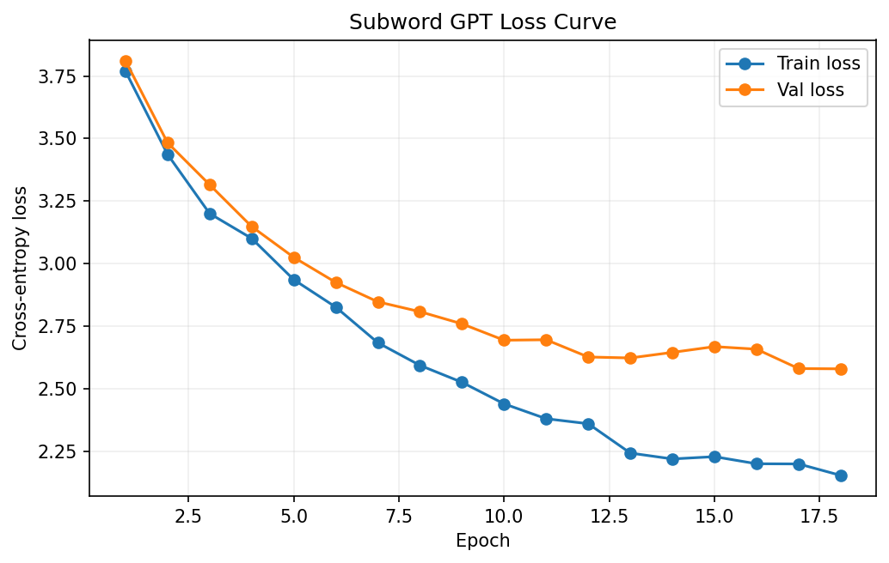

# 子词级 GPT 实验速查

主阅读入口：

- [06-子词级GPT：从BPE到更像真实LLM的训练流程](../../notes/06-子词级GPT：从BPE到更像真实LLM的训练流程.md)

## 包含实验

| 实验 | 作用 | 最佳验证困惑度 |
| --- | --- | ---: |
| `subword-gpt v1` | 建立可展示的子词级 GPT 基线 | `19.51` |
| `subword-gpt v2` | 在完整 GPT 工作流下继续提升表现 | `13.19` |
| `smoke-subword-gpt` | 链路冒烟验证 | `287.27` |



## 运行命令

```bash
pip install -r ../requirements.txt
python train_gpt.py
```

导出不同温度下的生成结果：

```bash
python generate_samples.py --run-dir outputs/<experiment-name> --temperatures 0.6 0.8 1.0 --top-k 40 --top-p 0.95
```

## 输出目录

- `data/`：语料与 tokenizer 文件
- `outputs/<experiment-name>/`：配置、指标、最佳权重、生成样例和 loss 曲线

这些目录默认仅用于本地运行，不纳入版本控制。

## 代码入口

| 路径 | 作用 |
| --- | --- |
| `train_gpt.py` | 训练入口 |
| `generate_samples.py` | 采样导出入口 |
| `subword_gpt_experiments/tokenizer.py` | BPE tokenizer 相关逻辑 |
| `subword_gpt_experiments/models.py` | 模型定义 |
| `subword_gpt_experiments/runner.py` | 训练主流程 |
